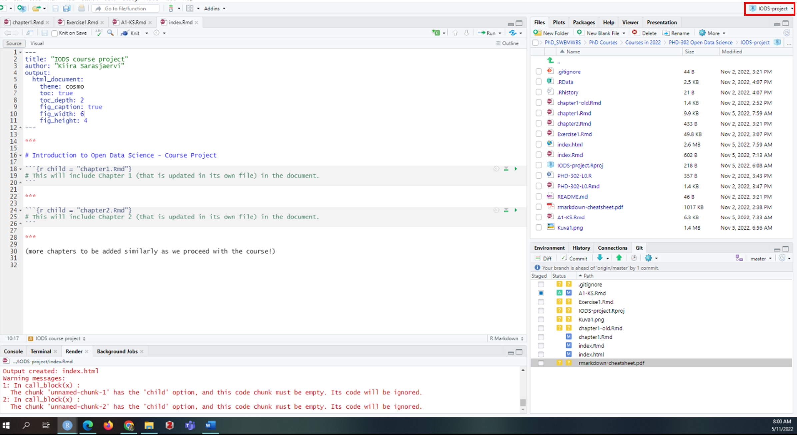
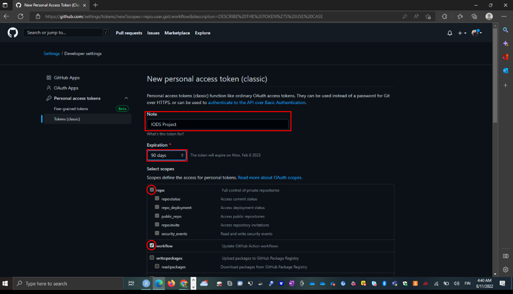
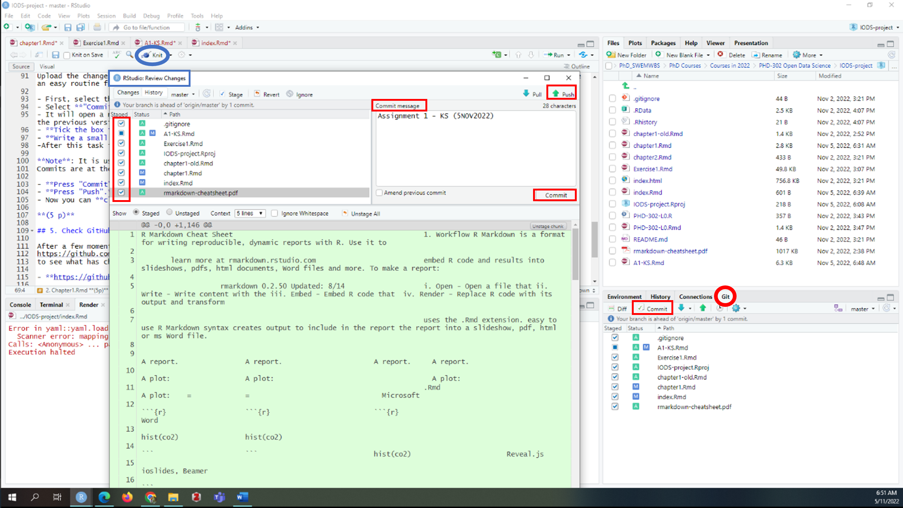

# About the project

*Write a short description about the course and add a link to your GitHub repository here. This is an R Markdown (.Rmd) file so you should use R Markdown syntax.*

```{r}
# This is a so-called "R chunk" where you can write R code.

date()

```
The text continues here.

- **NOTE.** <span style="color: red;">This is updated version from previous Assignment (added Personal Access Token, PAT)</span>

# Assignment 1: Tasks and Instructions

## 1. Getting started **(3p)**

1. Check that you have everything installed and created according to the instructions. You should have 
  - a GitHub repository: **https://github.com/kiirasar/IODS-project**
  - a course diary web page (also on GitHub, in a different address): **https://kiirasar.github.io/IODS-project**
  - the IODS-project started on RStudio using the course templates:
   

## 2. Chapter1.Rmd **(5p)**

Open the file **chapter1.Rmd** located in your IODS-project folder with RStudio. Just write some of your thoughts about this course freely in the file, e.g., 

```{r}
# This is a so-called "R chunk" where you can write R code.

date()

```
**1. How are you feeling right now?** 

I am excited about the course. It is a bit intimidating, since it seems that there is quite a lot of work. But, I cant wait to be able to apply what I will learn here to my own research.  

**2. What do you expect to learn?** 

I am a PhD student and I found the course content very fitting for my needs. I am the most excited to learn more about GitHub and R Markdown. Also, the classes regarding model validation (2), clustering/classification (4), and dimensionality reduction techniques (5) are very interesting topics for me, since I am doing my PhD on psychometric validation of (Short) Warwick-Edinburgh Mental Well-being Scale, (S)WEMWBS, among Finnish population.  


**3. Where did you hear about the course?**

I remember taking one of the Kimmo's course almost 10 years ago, when I was an undergraduate. Even though the course at the time was held in very early morning, I really enjoyed his class. I live in Austarlia, and When I noticed (in Sisu) that he is holding an **online** course again, I signed up immediately.

-----------------------------------------------------------------------------------------------------------

Also reflect on your learning experiences with the R for **Health Data Science book** and the **Exercise Set 1**: 

**4. How did it work as a "crash course" on modern R tools and using RStudio?**

I have used RStudio before, so I am familiar with the program and I had everything already installed. However,  this is the first time when I will be using **R Markdown** and **GitHub**.  

I also have another statistics course at the moment where will be using R Markdown, so I am excited to learn the syntax and get familiar with the program, along with GitHub, to see how I can use it in my own research. **GitHub** for example, could work really well, when I have multiple different scripts that I will be testing/editing. I also really like the layout of **R Markdown**, it is so much easier to follow when you knit it, than normal R script. The interactive features are amazing and can be really cool to add as supplementary material into your manuscript, so people could view different scenarios and examine the topic a bit more deeper.

Also, **the R Markdown Tutorial** was very helpful.
[R Markdown Tutorial](https://rmarkdown.rstudio.com/lesson-1.html)

**5. Which were your favorite topics?**

I really like the layout of R Markdown and the Cheat Sheet
[Cheat Sheet](https://www.rstudio.com/wp-content/uploads/2015/02/rmarkdown-cheatsheet.pdf)

Also, I found that the **R for Health Data Science** book very helpful and I know that I will be using it a lot in the future. It seems to have very illustrative examples and code that I can adapt to my own research. I think it will be much more useful when later on we have actual exercises when we need to write our own code. I tend to use Stack Overflow, general Googling, and other peoples code as dictionary or grammar book,  when I need to solve some issues with my code. In my opinion you learn the best when you are simultaneously trying to apply the piece of code to solve a problem. Just reading/viewing it is also helpful, but it is hard to grasp all the information at once without a specific task you try to solve. 

**6. Which topics were most difficult?**

I think I have okay understanding of R and RStudio. I know how to "read" and "edit" most of the code, intall and use new packages, etc. The difficult part is when you have an idea what you want to do, and you try to find the best way to edit the code (for example, getting certain colours, divide data based on stratas etc.). Sometimes the packages have different syntax than the "normal" R code, even the syntax in R Markdown is different (e.g., how to mark comments). 

However, I found the example code in **Exercise1.Rmd** very helpful to get started. I would prefer if **R for Health Data Science** would also have a PDF version, since I prefer to have a copy saved on my personal laptop, so I could highlight and add comments to the text. Also, if I understood it correctly, the book is based on around using **the tidyverse-package**, since pipe **%>%** is a part of this package, and would not work if you don't have tidyverse() installed. There are many ways to write the R code by using different packages and some are using the basic R code and some their own, and sometimes they are mixed. Having a tutorial that would help to understand which syntax you need/can use would be very beneficial. 

However, I have not used the **GitHub** before, so I found it quite difficult to get it started and understand the layout and what things are saved to my personal computer/files and which are online. **"Committing"** and **"Pushing"** things to GitHub seemed also quite hard at the start. 

I also find it challenging to learn/understand the YAML at the start of **R Markdown** script, and how to edit them 

- title: "**Introduction to Open Data Science, Exercise set 1**"
- subtitle: "**R basics using the RHDS book**"
- output: 
-  html_document:
-    theme: flatly
-    highlight: haddock
-    toc: true
-    toc_depth: 2
-    number_section: false

For example, my **index.Rmd** code did not run at the start and trying to find the ways to fix it was difficult. In the end it just worked even though I did not change anything - I think it was trying to knit the script into something else than html.


Also add in the file a link to your GitHub repository (that you created earlier):
https://github.com/your_github_username/IODS-project

- My GitHub repository: **https://github.com/kiirasar/IODS-project**

Remember to save your chapter1.Rmd file.

## 3. index.Rmd **(2p)**

Open the **index.Rmd** file with RStudio. 

At the beginning of the file, in the YAML options below the 'title' option, add the following option: author: "Your Name". Save the file and "knit" the document (there's a button for that) as an HTML page. This will also update the index.html file. 


**index.Rmd error code**

<span style="color: red;">Error in yaml::yaml.load(..., eval.expr = TRUE) : 
  Parser error: while parsing a block mapping at line 1, column 1 did not find expected key at line 3, column 3
Calls: <Anonymous> ... parse_yaml_front_matter -> yaml_load -> <Anonymous>
Execution halted</span>

## <span style="color: red;"> 4.(This point added on Mon 7 Nov 2022)</span> Create a **Personal Access Token (PAT)** **(5 p)**

To make the connection between RStudio and GitHub as smooth as possible, you should create a **Personal Access Token (PAT)**.

The shortest way to proceed is to follow the steps below. (Source: https://happygitwithr.com/https-pat.html)

Execute the R commands (preceded by '> ') in the RStudio **Console** (below the Editor):

**> install.packages("usethis")**
**> usethis::create_github_token()**

GitHub website will open in your browser. Log in with your GitHub credentials.

- Write a Note in the box, for example **"IODS Project"**.
- Select an **Expiration** time for your PAT, e.g., 50 days.
- The pre-selected **scopes** "repo", "workflow", "gist", and "user" are OK.
- Press <mark style="background-color: green">**"Generate token"**</mark> and
- **copy the generated PAT to your clipboard**.



Return to RStudio and continue in the **Console**:

**> gitcreds::gitcreds_set()**

- WAIT until a prompt "Enter password or token:" appears.
- **Paste** your PAT to the prompt and **press Enter**.

Apparently, I already had **PAT**, but I decided to update it, so I could finish this assignment.
Now you should be able to work with GitHub, i.e., push and pull from RStudio.

## 5. Upload changes to GitHub **(5p)**
Upload the changes to GitHub (the version control platform) from RStudio. There are a few phases (don't worry: all this will become an easy routine for you very soon!):

- First, select the **"Git"** tab in the upper right corner of RStudio. You will see a list of modified files.
- Select **"Commit"**. 
- It will open a new **"Review Changes"** window showing more detailed information of the changes you have made in each file since the previous version.
- **Tick the box in the front of each file** (be patient, it takes some time for the check to appear).
- **Write a small commit message** (there's a box for that) that describes your changes briefly. 
- After this task is completed (not yet), both the changes and the message will be seen on **GitHub**. 

**Note**: It is useful to make commits often and even on small changes.  
Commits are at the heart of the version control system, as a single commit represents a single version of the file.)  

- **Press "Commit".**(RStudio uses Git to implement the changes included in the commit.)
- **Press "Push".** (RStudio uses Git to upload the changes to your GitHub repository.)
- Now you can **close the "Review Changes"** window of RStudio. Good job!! 

  

## 5. Check GitHub and Submit Your Assignment

After a few moments, go to your **GitHub repository** at
https://github.com/your_github_username/IODS-project
to see what has changed (please be patient and refresh the page).

- **https://github.com/kiirasar/IODS-project**

Also visit your **course diary** that has been automatically been updated at
https://your_github_username.github.io/IODS-project
and make sure you see the changes there as well.

- **https://kiirasar.github.io/IODS-project**

After completing the tasks above you are ready to **submit your Assignment** for the review (using the Moodle Workshop below). Have the two links (**your GitHub repository and your course diary**) ready!  
Remember to get back there when the Review phase begins (see course schedule).

- **https://github.com/kiirasar/IODS-project**
- **https://kiirasar.github.io/IODS-project**

----------------------------------------------------------------------------------------------------------
End of Assignment 1: Tasks and Instructions


