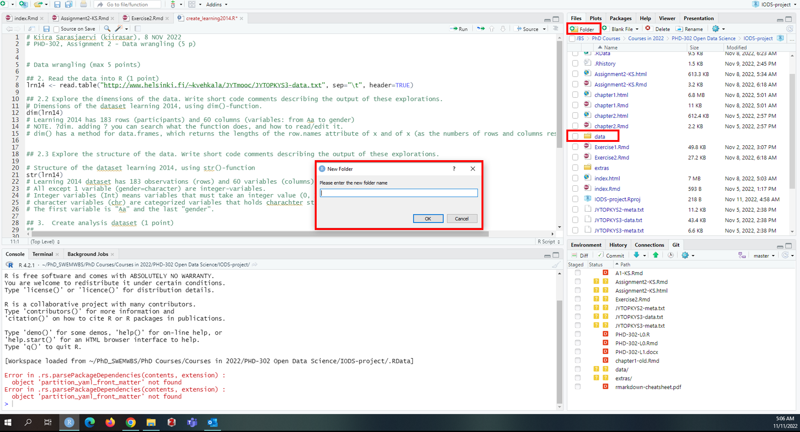
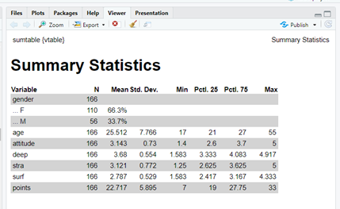
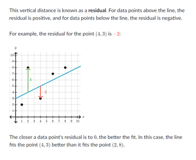
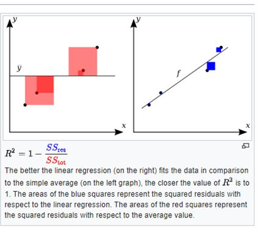

----------------------------------------------------------------------------------------------------------------------------------------

# Assignment 2: Tasks and Instructions

*Describe the work you have done this week and summarize your learning.*

- Describe your work and results clearly. 
- Assume the reader has an introductory course level understanding of writing and reading R code as well as statistical methods.
- Assume the reader has no previous knowledge of your data or the more advanced methods you are using.


```{r}
date()
```

## Data wrangling **(max 5 point)**

**TASK INSTRUCTIONS:** Create a folder named ‘data’ in your IODS-project folder. Then create a new R script with RStudio. Write your name, date and a one sentence file description as a comment on the top of the script file. Save the script for example as **create_learning2014.R** in the **data** folder. Complete the rest of the steps in that script.

Figure demonstrates how to create a new folder.




Please see **create_learning2014.R** and **lrn14_KS.csv** to evaluate the Data wrangling from my a GitHub repository: **https://github.com/kiirasar/IODS-project** you can find the files in **data** folder.


## Analysis **(max 15 points)**

First we install/use R packages we need to complete the assignment.

```{r}
# Select (with mouse or arrow keys) the install.packages("...") and
# run it (by Ctrl+Enter / Cmd+Enter):

# install.packages("GGally")
#install.packages("GGally")
#install.packages("tidyverse")
#install.packages('readr')
#install.packages('ggplot2')
#install.packages("psych")
#install.packages("vtable")
library(vtable)
library(psych)
library(GGally)
library(tidyverse)
library(readr)
library(ggplot2)
```


----------------------------------------------------------------------------------------------------------------------

### 1. Read and describe the data **(0-2 points)**

**TASK INSTRUCTIONS:** Read the **students2014** data into R either from **your local folder** (if you completed the Data wrangling part) or from this [**url**](https://raw.githubusercontent.com/KimmoVehkalahti/Helsinki-Open-Data-Science/master/datasets/learning2014.txt).  

Explore the **structure** and the **dimensions** of the data and describe the dataset briefly, assuming the reader has no previous knowledge of it. Information related to data can be found  
[here](https://www.mv.helsinki.fi/home/kvehkala/JYTmooc/JYTOPKYS3-meta.txt)  

```{r}
# Read the data from your local drive using setwd()-command

# setwd('C:\\Users\\Kiira\\Documents\\PhD_SWEMWBS\\PhD Courses\\Courses in 2022\\PHD-302 Open Data Science\\IODS-project')
# lrn14 <- read_csv("data/lrn14_KS.csv")
# head(lrn14) #gender, age, A_att, A_deep, A_stra, A_surf, points
# View(lrn14)

# or from url
std14 <- read.table("https://raw.githubusercontent.com/KimmoVehkalahti/Helsinki-Open-Data-Science/master/datasets/learning2014.txt", sep=",", header=T) # sep=separator is a comma, header=T

head(std14) #gender, age, attitude, deep, stra, surf, points
View(std14)
```


**head()** command is used to show the first 6 lines of the datase, whereas **View()** opens the whole dataset into a new tab.

**NOTE.** data from **local drive** is named as **lrn14** and data from **url** as **std14**.  
*Read_csv*-command worked on R before, but I could not knit the document for some reason. This is why its only there as comments and I decide use the url (std14) dataset. The data is exact same, only the variable names are different. I will use the url data to complete the assignment. 


```{r}
dim(std14)
```


**dim()** is R function to explore the dimension of the dataset. The dataset has 166 rows (observations) and 7 columns (variables).You can read the name of the variables or have better look at the data by using **head(std14)** and **View(std14)**

```{r}
str(std14)
```


**str()** is R function to explore the structure of the dataset. The dataframe has 166 observations and 7 variables, like in **dim()**.

- **gender** is the only **character**, chr, (categorical) variable. It has 2 different values: F=female and M=male
- **age** and **points** are **integral**, int, variables, meaning those don't have any decimals. 
- **attitude, deep, stra**, and **surf** are **numerical**, num, variables, with decimals. These variables are also mean-variables based on specific questions/items that were measuring each learning type.

------------------------------------------------------------------------------------------------------------------

### 2. Graphical overview of the data **(0-3 points)**

**TASK INSTRUCTIONS:** Show a **graphical overview** of the data and show **summaries** of the variables in the data. **Describe** and **interpret** the outputs, commenting on the **distributions** of the variables and **the relationships** between them. 

**SUMMARY STATISTICS:**  
To explore the summaries of each variable I used **vtable**-package and **st()**-command, also know as sumtable().   
Here is [link](https://cran.r-project.org/web/packages/vtable/vignettes/sumtable.html) where you can find more information regarding **vtable** and **st()**-command


```{r}
st(std14) # the command prints a summary statistics table to Viewer-window
```




Dataset std14 has a total of 166 observations (participants) and 7 variables (gender, age, attitude, deep, stra, surf and points). In the dataset:

- **Gender:** 66.6% are female (F) and the rest 33.7% male (M)
- **Age:** Mean age is 22.5 years-old, with std 7.8. Age range is between 17 and 55.

**NOTE.** The different learning methods (deep, stra, surf) are average based on several items for each learning method. The summary display the basic descriptive statistics: mean, standard deviation, minim, lower and upper quartiles (25% and 75%) and maximum. The scale among learning techniques are 1-5.

- **Attitude:** mean attitude is 3.1 (0.7), with range between 1.4 and 4.9. lower quartile (25%) is 2.6 and higher quartile (75%) 3.7 points.
- **Deep:** mean deep learning is 3.7 (0.6), with higher and lower quartiles 3.3 and 4.1, respectively. Range is between 1.6 and 4.9
- **Stra:** mean strategic learnign (stra) is 3.1 (0.8), ranging between 1.3-5.0 25% and 75% 2.6 and 3.6, respectively.
- **Surf:** mean surface learning (surf) is 2.8 (0.5), range 1.6-4.3. lower quartile (2.4) and higher quartile (3.2)

**Points** denotes the students exam points in a statistics course exam.

- **Points:** mean points were 22.7 (5.9), ranging between 7 and 33 points with lower quartile of 19 and upper 27.75 points.


**BARPLOTS - Nominal variables**:  

I used **ggplot**-package and **barplot** to explore the distributions and counts based of gender (nominal)

```{r}
# ggplot()=command, std14=dataframe, eas(x=variable) + type of plot
gg_gender <- ggplot(std14, aes(x=gender)) + geom_bar() #barplot for nominal variables.
gg_gender

# you can make the plots looking prettier by adding extra code:
ggplot(std14, aes(x=as.factor(gender), fill=as.factor(gender) )) +
  geom_bar(aes(fill=gender)) + 
  geom_text(stat='count',aes(label=..count..),vjust=-0.3) + #Adding counts on top of the bars
  labs(x = "", fill = "gender") + #filling bars based on gender
  ggtitle("Barplot based on gender Learning 2014 dataset") + #adding title
  ylab("count")+ xlab("gender") + #adding x and y labels
   scale_x_discrete(labels=c("F" = "Female", "M" = "Male")) #changing F into female and M into male

```


According to the previous summary table and barplot dataset std14 has 110 female and 56 male participants.

**HISTOGRAMS - Continuous variables**:   

I made histograms for every continuous variable: age, attitude, deep, stra, surf, and points, in order to check if these are normally distributed - meaning that the distribution follows the [bell curve](https://www.mathsisfun.com/data/standard-normal-distribution.html). If variables are not normally distributed, we can't use parametric statistical approaches e.g., general regression models, but rather non-parametric statistical methods. 

**NOTE.** When making plots, it is important to include everyone. Some people might have difficulties see all the colours e.g., colour blind, so it is imporant to use right colours. On this [website](http://www.cookbook-r.com/Graphs/Colors_(ggplot2)/) you can find inclusive colour pallets.

- Palette with grey: **cbPalette** <- c("#999999", "#E69F00", "#56B4E9", "#009E73", "#F0E442", "#0072B2", "#D55E00", "#CC79A7")
- Palette with black: **cbbPalette** <- c("#000000", "#E69F00", "#56B4E9", "#009E73", "#F0E442", "#0072B2", "#D55E00", "#CC79A7")

The **#CODE** are referring to certain colours.

Also, I wanted to print all the plot in one page by using **multiplot()**-command which is part of ggplot-package. Before using the command I needed to run a code that can be found [here](https://stackoverflow.com/questions/24387376/r-error-could-not-find-function-multiplot-using-cookbook-example)


```{r}

multiplot <- function(..., plotlist = NULL, file, cols = 1, layout = NULL) {
  require(grid)

  plots <- c(list(...), plotlist)

  numPlots = length(plots)

  if (is.null(layout)) {
    layout <- matrix(seq(1, cols * ceiling(numPlots/cols)),
                 ncol = cols, nrow = ceiling(numPlots/cols))
}

if (numPlots == 1) {
print(plots[[1]])

} else {
grid.newpage()
pushViewport(viewport(layout = grid.layout(nrow(layout), ncol(layout))))

for (i in 1:numPlots) {
  matchidx <- as.data.frame(which(layout == i, arr.ind = TRUE))

  print(plots[[i]], vp = viewport(layout.pos.row = matchidx$row,
                                  layout.pos.col = matchidx$col))
 }
}
 }

```


Then I created a histogram for each continuous variable and used the colours from 

- **cbPalette** <- c("#999999", "#E69F00", "#56B4E9", "#009E73", "#F0E442", "#0072B2", "#D55E00", "#CC79A7")

```{r}

# NOTE. you can also use "=" instead of "<-" to create objects. However, ofter "<-" is better, since some packages might use "=" for something else.

p1=ggplot(std14) + 
  geom_histogram(aes(x = age), fill = "#E69F00") +
labs(title="Age")

p2=ggplot(std14) + 
    geom_histogram(aes(x = attitude), fill = "#56B4E9") +
  labs(title="Attitude")

p3=ggplot(std14) + 
    geom_histogram(aes(x = deep), fill = "#009E73")+
  labs(title="Deep learning")

p4=ggplot(std14) + 
    geom_histogram(aes(x = stra), fill = "#F0E442")+
  labs(title="Strategic learning")

p5=ggplot(std14) + 
    geom_histogram(aes(x = surf), fill = "#0072B2")+
  labs(title="Surface learning")

p6=ggplot(std14) + 
  geom_histogram(aes(x = points), fill = "#D55E00")+
  labs(title="Points")
```


Last, I ran the multiplot()-command.


```{r}
multiplot(p1, p2, p3, p4, p5, p6, cols=3) #prints 3 columns
```

**Summary regarding the results:** 

- Variables **age** and **points** are using different scale than the other ones (other variables: 1-5)
- **Age:** is a bit skewed on left, meaning there are more "younger" than older. If age would be normally distributed, the "peak" should be more in the middle (approx. 30-40 years). Otherwise, all the other variables seem to be normally distributed. 

Next, I wanted to create a histogram where I added all the **learning strategies** on top of each other.

```{r}

# NOTE. alpha=.5, makes the colours trasparent 50%.

ggplot(std14) + 
  geom_histogram(aes(x = deep), fill = "#009E73", alpha=.5) + # green
  geom_histogram(aes(x = stra), fill = "#F0E442", alpha=.5) + # yellow
  geom_histogram(aes(x = surf), fill = "#0072B2", alpha=.5) + # blue
  labs(title="Learnign strategies", x="Learning strategies (Mean)")

```

**Summary regarding the results:** 

- You can see that deep learning (green) is a bit more skewed right than the other scales. Similarly, surface learning (blue) is a bit skewed on left. 

**RELATIONSHIP between the variables:**  

**ggpairs()-comman** is part of ggplot and it creates more advanced plot matrix where you can explore the relationships between the variables.

```{r}
ggpairs(std14, mapping = aes(), lower = list(combo = wrap("facethist", bins = 20)))

#p <- ggpairs(learning2014, mapping = aes(col=gender,alpha=0.3), lower = list(combo = wrap("facethist", bins = 20)))
# This draws two distributions etc for both male and female participants separately. 

```


The command prints out:

**Histograms (first 2 columns on left)** based on gender (female, male) 

- more female than male participants
- all other variables, expect age seem to be more or less normally distributed

**Boxplots (first row)** based on gender: female (top), male (bottom)

- Think line illustrates mean, both ends of the boxes are 25% and 75% quartiles. The lines are illustrating confidential intervals and dots are outliers (single participants)
- Based on the means of each boxplot: females are **younger**, have **lower** attitudes and bit **lower** deep learning scores, but **higher** strategic and surface learning points than males. There does not seem to be difference based on the means in overall points.
- However, there does not seem to be **statistical difference** based on gender (all boxes are align with each other). 

**Normal distributions (diagonal)** only for continuous variables

- **Age** seem to be most skewed on left (much younger paricipants than old ones)
- All the other continuous variables seem to be more or less normally distributed [bell-curve](https://study.com/learn/lesson/bell-curve-theory-themes.html))

**Correlations (up diagonal)** only for continuous variables

- Only few relationship are statistical significant (p<.001, p<.01, p<.05 three, two and one*, respectively)
  - strategic learning and surface learning (**negative correlation; r= -0.161**) meaning **higher stra** is associated with **lower surf**, and vice versa
  - attitude and surface learning (**negative correlation; r= -0.176**) meaning **higher attitude** is associated with **lower surf**, and vice versa.
  - deep learning and surface learning (**negative correlation; r= -0.324**) meaning **higher deep** is associated with **lower surf**, and vice versa.
   - points and attitude (**positive correlation; r= 0.437**) meaning **higher points** is associated with **higher attitude**, and vice versa.

**Scatterplots** - Relatinships between continuous variables

- On the figure above the scatterplots are below the diagonal (normal distribution graphs). Scatterplots illustrate the correlation results and therefore 
  - negative correlation = line goes down
  - positive correlation = line goes up
  - no correlation = straight line

However, the figure is quite small, so it is easier to explore the scatterplots by using pairs() command.


```{r}

# this piece of code excludes the gender (nominal variable)
pairs(std14[-1]) 
```


But even that is quite ugly. Also, the plots below and above the diagonial line are identical (just opposite scaling).
To make the scatterplots nicer, we can create nicer scatterplots with ggplot.

**Age scatterplots**

```{r}
# Age
sp1 <- ggplot(std14, aes(x = age, y = attitude)) +
  geom_point() + #scatterplot
  geom_smooth(method = "lm") + #regression line
  labs(title="Scatterplot: age and attitude")


sp2 <- ggplot(std14, aes(x = age, y = deep)) +
  geom_point() + #scatterplot
  geom_smooth(method = "lm") + #regression line
  labs(title="Scatterplot: age and deep learning")

sp3 <- ggplot(std14, aes(x = age, y = stra)) +
  geom_point() + #scatterplot
  geom_smooth(method = "lm") + #regression line
  labs(title="Scatterplot: age and strategic learning")

sp4 <- ggplot(std14, aes(x = age, y = surf)) +
  geom_point() + #scatterplot
  geom_smooth(method = "lm") + #regression line
  labs(title="Scatterplot: age and surface learning")

sp5 <- ggplot(std14, aes(x = age, y = points)) +
  geom_point() + #scatterplot
  geom_smooth(method = "lm") + #regression line
  labs(title="Scatterplot: age and points")


multiplot(sp1, sp2, sp3, sp4, sp5, cols=3)

# age and attitude, r=0.022
# age and deep learning, r=0.025
# age and strategic learning, r=0.102
# age and surface learning, r=-0.141
# age and points, r=-0.093

```


Since **age** is very skewed the correlation between other variables are very low. Meaning the scatterplots and regression line is very flat, indicating low or non-correlation. Age does not seem to be related to different learning techniques, attitudes or overall exam points. However, age was also very skewed meaning a lot of people were same age, that may affect the results.

**Attitude scatterplots**

```{r}
## Attitude 
sp6 <- ggplot(std14, aes(x = attitude, y = deep)) +
  geom_point() + #scatterplot
  geom_smooth(method = "lm") + #regression line
  labs(title="Scatterplot: attitude and deep learning")

sp7 <- ggplot(std14, aes(x = attitude, y = stra)) +
  geom_point() + #scatterplot
  geom_smooth(method = "lm") + #regression line
  labs(title="Scatterplot: attitude and strategic learning")

sp8 <- ggplot(std14, aes(x = attitude, y = surf)) +
  geom_point() + #scatterplot
  geom_smooth(method = "lm") + #regression line
  labs(title="Scatterplot: attitude and surface learning")

sp9 <- ggplot(std14, aes(x = attitude, y = points)) +
  geom_point() + #scatterplot
  geom_smooth(method = "lm") + #regression line
  labs(title="Scatterplot: attitude and points")

multiplot(sp6, sp7, sp8, sp9, cols=2)
#attitude and deep learning, r=0.110
#attitude and strategic learning, r=0.062
#attitude and surface learning, r= -0.176*
#attitude and points, r=0.437***

```


The first two graphs (on left column) had very small correlation and the line was very flat.  
The relationship between **attitude and surface learning (top right)** shows a small significant **negative correlation (r= -0.176)**, indicating that the line goes down: people with higher surface learning points, would have higher chance to have lower attitude points as well.  
This could mean that people who use surface learning techniques have worsen attitude towards learning in general. 

Alternatively, the relationship between **attitude and points (down right)** show significant **positive correlation (r=0.437)**; the line goes up. Indicating that individuals with high attitude points would often also have high overall points - and vice versa; individual with low attitude would also have low overall points.  
One interpretation of these finding is that people who have good attitude towards learning will also success better in their exams. 

**Deep learning scatterplots**

```{r}
# deep

sp10 <- ggplot(std14, aes(x = deep, y = stra)) +
  geom_point() + #scatterplot
  geom_smooth(method = "lm") + #regression line
  labs(title="Scatterplot: deep and strategic learning")


sp11 <- ggplot(std14, aes(x = deep, y = surf)) +
  geom_point() + #scatterplot
  geom_smooth(method = "lm") + #regression line
  labs(title="Scatterplot: deep and surface learning")

sp12 <- ggplot(std14, aes(x = deep, y = points)) +
  geom_point() + #scatterplot
  geom_smooth(method = "lm") + #regression line
  labs(title="Scatterplot: deep learning and points")

multiplot(sp10, sp11, sp12, cols=2)
#deep and strategic learning, r=0.097
#deep and surface learning, r= -0.324***
#deep learning and points, r= -0.010
```


Only, relationship between **deep and surface learning (bottom left)** had **significant correlation (r= -0.324)**. The correlation was also **negative**, meaning that higher deep learning scores were associated with lower surface learning scores and vice versa. 

This could mean that people who often use deep learning techniques do rarely use surface learning techiques and vice versa.  

Other relationship showed barely any correlation and therefore the line was fairy flat. 

**Strategic learning**

```{r}
# stra

sp13 <- ggplot(std14, aes(x = stra, y = surf)) +
  geom_point() + #scatterplot
  geom_smooth(method = "lm") + #regression line
  labs(title="Scatterplot: strategic and surface learning")

sp14 <- ggplot(std14, aes(x = stra, y = points)) +
  geom_point() + #scatterplot
  geom_smooth(method = "lm") + #regression line
  labs(title="Scatterplot: strategic learning and points")


sp15 <- ggplot(std14, aes(x = surf, y = points)) +
  geom_point() + #scatterplot
  geom_smooth(method = "lm") + #regression line
  labs(title="Scatterplot: surface learning and points")

multiplot(sp13, sp14, sp15, cols=2)
#strategic and surface learning, r= -0.161*
#strategic learning and points, r=0.146
#surface learning and points, r= -0.144

```


Only the association between **strategic and surface** learning showed significant correlation, which was **negative (r=-0.161)**, meaning that lower points were associated with higher surface learning points.  
This could mean that people who only use surface learning techniques will struggle to grasp more deeper understanding of different concepts that could lead lower exam points. 


Below there is a code and figure with all the scatterplots by using **multiplot()**, but yet again, the graphs are too small, so the interpretation of the findings is difficult.


```{r}
multiplot(sp6, sp7, sp8, sp9, sp10, sp11, sp12, sp13, sp14, sp15, cols=4) #prints 5 columns
```

----------------------------------------------------------------------------------------------------------------------------------------


### 3. Regression model - outcome variable **(0-4 points)**  &  
### 4. Interpret the model parameters and R-square **(0-3 points)**

**TASK INSTRUCTIONS:** Choose **three** variables as explanatory variables and fit a regression model where exam points is the target (dependent, outcome) variable. **Show a summary** of the fitted model and comment and **interpret the results**. Explain and interpret the statistical test related to the model parameters. If an explanatory variable in your model **does not** have a statistically significant relationship with the target variable, remove the variable from the model and fit the model again without it. **(0-4 points)**     

Using a **summary** of your fitted model, explain the relationship between the chosen explanatory variables and the target variable (**interpret the model parameters**). Explain and **interpret** the multiple **R-squared** of the model.  **(0-3 points)**     

- dependent (y): points
- indepedent (x): deep, strategic and surface learning

I choose these three independent variables, since they are different strategies how people learn.

```{r}
my_model3 <- lm(points ~ deep + stra + surf, data = std14)
# my_model3 #call the linear model, intercept and slopes.
summary(my_model3) #summary of the model, including the single variable statistical significant summaries
```

Based on the model only **strategic** and **surface learning** are statistical significant (. = 0.10), but **deep learning** is not.

- **Deep learning:** Using deep learning techniques seem to have worsen impact on exam points (estimate= -0.7443), meaning the when deep learning increases 1 point, it will lower the exam points by -0.7443 points. This is surprising, since I would have assumed that deep learning methods would be associated with higher exam points. On the other hand, the correlation between deep learning and points were negative, yet not significant. Overall, deep learning is not statistically significant in this model (p-value is greater than 0.1), this learning technique does not seem to explain/predict exam points.
- **Stretegic learning:** Using strategic learning techniques has a positive impact on exam points, meaning that when strategic learning increases 1 point, exam points increases by 0.9878 points. This is also statistically significant (p<.10). However, this is not very significant impact. This sort of makes sense, since using strategic learning techniques allows the individual be more adaptable and tehy might use more time to undertsand the overall content instead of going through everything very "deeply".
- **Surface learning:** Using surface learning techniques was negatively associated with exam points. This effect was also significant (p<.01). This means that when surface learning increases by 1 point, it decreases the exam points by -1.6296.

However, the model explain only **4-2.3%** of the exam results (Multiple R-squared = 0.04071 and Adjusted R-square = 0.02295). Also the **overall p-value** of the whole model is relatively bad **0.08016**. 

**Overall, it seems that different learning techniques will pay either none or only little role in explaining overall exam points.**

Since, **deep learning** is not statistically significant, I will remove it from the model and fit the model again without it. 

**NOTE.** Overall, p<.01 is not very good result, normally p<.05 is the level of statistical significant results at least in my research field (psychology).

```{r}
my_model2 <- lm(points ~ stra + surf, data = std14) #exclude deep learning from the model
summary(my_model2) #summary of the model
```

When excluding the "deep learning" from the model, **neither strategic** or **surface learning** remain significant. 

As additional task, I wanted to try a completely new model, where **attitude, deep** and **surface learning** could try to explain the **exam points**. I chose these, since they had the highest correlations. However, this might cause multi-collienarity that can impact on our results.

- dependent (y): points
- indepedent (x): attitude, deep, and surface learning

```{r}
my_model32 <- lm(points ~ attitude + deep + surf, data = std14)
summary(my_model32) #summary of the model, including the single variable statistical significant summaries
```

Interestingly, **neither deep or surface learning were significant** independent variables to predict/explain exam points. However, **attitude was highly significant (p<.0001)**. The results might be caused by the high positive association/correlation between attitude and exam points.

- **Attitude:** was **statistically significant (p<.0001)** and **positively** associated with points. When attitude increases 1 point, exam points increases by 3.4661 points. 
- **Deep learning:** even though deep learning was not significant it has a bit higher negative association to exam points in comparison to previous model3. One increase in deep learning worsens the exam points by -0.9485 points. 
- **Surface learning:** similar to deep learning, surface learning had higher negative, yet non-significant, impact in this model than the previous (model3). For each increase, the exam points lowered -1.0911 points.  

**Overall, it seem that attitude plays much more bigger role explaining exam results than learning techniques. **

The new model is also much better than the previous (model3): **R-square was 0.2024**, meaning that this model explains **20%** variation in exam points. The models p-value was also much better than before: **p<.0001 ** 

Lastly, I excluded both learning techniques from the model to see if we could increase the model fit. 

```{r}
my_model1 <- lm(points ~ attitude, data = std14)
summary(my_model1) #summary of the model, including the single variable statistical significant summaries
```

This had a little impact:

- **Estimate** increased from 3.4661  to 3.5255 
- **Multiple R-squared** decreased from 0.2024 to 0.1906, this is due to number of indicators (more indicators, better fit)

---------------------------------------------------------------------------------------------------------------------------------

### 5. Plots **(0-3 points)**

**TASK INSTRUCTIONS:** Produce the following diagnostic plots: 

- **Residuals vs Fitted values**
- **Normal QQ-plot**
- **Residuals vs Leverage**.

**Explain** the assumptions of the model and **interpret the validity** of those assumptions based on the diagnostic plots.   

**FURTHER INSTRUCTIONS based on Exerice 2**: R makes it easy to graphically explore the validity of your model assumptions, by using **plot()**-command e.g., plot(my_model3).  
In the plot() function argument `which` can help you to choose which plots you want. We will focus on **plots 1, 2** and **5**: 

which | graphic                                 
----- | --------
1     | Residuals vs Fitted values 
2     | Normal QQ-plot
3     | Standardized residuals vs Fitted values
4     | Cook's distances
5     | Residuals vs Leverage 
6     | Cook's distance vs Leverage 


Before the call to the `plot()` function, add the following: **`par(mfrow = c(2,2))`**. This will place the following 4 graphics to the same plot.


**RESIDUALS**  
In general the following graphs are focusing on exploring the residuals of the model. 

In statistical point of view, residual is the difference between predicted values of y (dependent variable) and observed values of y . So. Residual = actual y value − predicted y value, (ri=yi−^yi).

Another example explaining residuals is the distance from the linear line. If the observations is located **above** the linear line, residual is **positive** and if the observation is located **below** the line, it is **negative**.   

If our model would explain **100% of the variation of dependent variable**, **residual would be 0**, meaning that all the observations would be touching the linear line. 

In a way, you could say that residual is a measure of how well a linear line fits an individual data points.




The picture above is a screenshot from [khanacademy.org](https://www.khanacademy.org/math/statistics-probability/describing-relationships-quantitative-data/regression-library/a/introduction-to-residuals)

**R-square** on the other hand is calculated a correlation coefficient squared. Or, as well as, the **sum of squares of residuals** (also called the residual sum of squares, **SSres**) divided by the total sum of squares (proportional to the **variance** of the data, **SStot**) minus 1. 

One way to illustrare the **SSres** is to draw squares between linear line and single data points in a way that the square would touch the linear line. The sum of the squares are **SSres**. 



The picture above is a screenshot from [Wikipedia](https://en.wikipedia.org/wiki/Coefficient_of_determination).

Lastly, if the model explains only **5%** of the variance of chosen dependent variable (outcome, y), it means that the **residuals, everything else except the chosen independent variables (x), are explaining the rest 95% of the variance**. Meaning, that we were not able to successfully detect the whole phenomena.

In the **final assignment**, I will use the **first model (model3)** as example

- dependent (y): points
- indepedent (x): deep, strategic and surface learning

whereas, deep learning is not significant indicator, but strategic and surface learning variables are, but the **R^2 is very low (2%)**


```{r}
par(mfrow = c(2,2))
plot(my_model3, which = c(1,2,5))
```


**Residual vs Fitted**  
This graph illustrates the residuals non-linear patterns. **If the red line is roughly horizontal then we can assume that the residuals follow a linear pattern**. If the residuals are not linear, we would need to consider non-parametric statistical approaches to investigate the relationship between the variables. Sometimes, there might be relationship between the variables, even though it would not be linear. This plot helps us to detect any other possible non-linear relationship (parabolic/quadratic/polynominal, expotential, steps, etc.)    

Based on the graph, in **model 3 the line seem to be fairly horizontal, so we can claim that the residuals are following linear patter along with the indicators (dependent, x-variables).**   
**NOTE.** This are just "raw" residuals, not standardized

**Normal Q-Q**  
This graph is illustrating if the residuals of the regression model are the normal distributed. In a perfect world, **the dots would align with the linear line, indicating that the residuals are in deed normally distributed.** Each data point is presented in this picture (dot). 

In **model 3** it looks like that some observations from the begin and end of the data set are not in line with the linear model. However, **overall it is roughly following the line, so we can confirm that the residuals are normally distributed**.

**Residual vs Leverage**
**This graph is mainly used to spot influential data points, aka outlier**s, or single data points that could have an impact on our model. This graph can also be used to examine heteroskedasticity (different variance based on different independent variables) which can often be caused by an outlier. We can also investigate non-linearity with this graph.

- On the y-axis are the standardized residuals. If the data point is located **above 2 (or below -2)** it can be classified as having a high standardized residual value. 
- The x-axis gives us the leverage value for each point, which you can calculate based on the number of observations (166) and coefficients in the model (3 explanatory variables + the intercept). **(coefficient** divided by **observations) times 2**
- Plot also draws **Cook’s Distance**; any point that exists outside the 0.5 contour line has a high Cook’s distance.

See more [Rummerfield & Berman, 2017, page 3](https://www.ics.uci.edu/~jutts/110/Discussion_7.pdf)

In our exmaple, 

-we have **some observations that are below -2 (y-axis)** e.g., observations 145, 35, and 19
- The the average leverage is 4/166 ≈ 0.024 then any data point beyond 0.0482 or ≈ 0.05 (2 × 0.024) has a high leverage value**. In our model 3 there a some obervations passed 0.5 (x-axis)**, which we could drop out.
- However, our we cant even see the Cook's distance contour line and these outliers are not too far away from the suggested cut-off lines.

**Overall, we can conclude that our data does not have any (or only few) influential data points.**

--------------------------------------------------------------------------------------------------------------------------

End of Assignment 2: Tasks and Instructions
