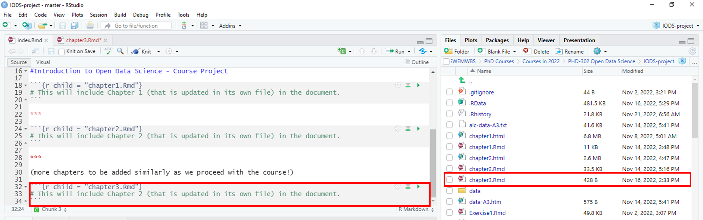

```{r setup, include=FALSE}
knitr::opts_chunk$set(echo = TRUE)
```


```{r}
date()
```

# Assignment 3: Tasks and Instructions

## 1. Data wrangling **(max 5 points)**

Please see **create_alc.R** to evaluate the Data wrangling from my a GitHub repository: **https://github.com/kiirasar/IODS-project** you can find the files in **data** folder.

-----------------------------------------------------------------------------------------------------

## 2. Analysis **(max 15 points)**

First we install/use R packages we need to complete the assignment.

```{r}
# Select (with mouse or arrow keys) the install.packages("...") and
# run it (by Ctrl+Enter / Cmd+Enter):

# install.packages("GGally")
#install.packages("GGally")
#install.packages("tidyverse")
#install.packages('readr')
#install.packages('ggplot2')
#install.packages("psych")
#install.packages("vtable")
library(vtable)
library(psych)
library(GGally)
library(tidyverse)
library(readr)
library(ggplot2)
library(tidyr)
library(dplyr)
```


-----------------------------------------------------------------------------------------------------

### 1. Create a new R Markdown file (chapter3.Rmd) and add this to your index.Rmd file



---------------------------------------------------------------------------------------------------------------

### 2. Read and describe the student alc data **(0-1 point)**

To read the dataset from either my local folder (read_csv()) or from url (reab.table()) use the commands in brackets.

```{r}
alc_KS <- read_csv("data/create_alc_KS.csv")
head(alc_KS) 

# or from url
alc_a3 <- read.table("https://raw.githubusercontent.com/KimmoVehkalahti/Helsinki-Open-Data-Science/master/datasets/alc.csv", sep=",", header=T) # sep=separator is a comma, header=T

head(alc_a3) # Shows the first 5 rows of the dataset
View(alc_a3) # Preview of the whole data set.

# In this assignment I will be using the dataset from url (alc_a3)
print(colnames(alc_a3)) # print the column names
glimpse(alc_a3) # have a bit better look at the data
```

Short description of the dataset **alc_a3** by using **glimpse()**-command.

- The data encompasses student achievement in secondary education of two Portuguese schools.
- 370 rows (participant, observations, datapoints)
- 35 columns (variables)
- first variable is **school**, last one is **high_use**
- 16 integral (int) variables (numeric): age, Medu, Fedu, traveltime, studytime, famrel, freetime, goout, Dalc, Walc, health, failures, absences, G1, G2, G3
- 17 charachter (chr) variables (nominal): school, sex, addres, famsize, Pstatus, Mjob, Fjob, reason, guardian, schoolsuo, famsup, activities, nursery, higher, internet, romantic, paid
- 1 double variable (dbl): alc_use. All real numbers are stored in double precision format.
- 1 logical (lgl) variable: high_use. Gets value "TRUE" is alc_use is higher than 2.0.


More detailed description of the dataset can be found [here](https://archive.ics.uci.edu/ml/datasets/Student+Performance) and **Exercise3.Rmd** as well as in **Moodle** (Assignment 3: Tasks and Instructions)

-----------------------------------------------------------------------------------------------------------------------------------

### 3. Hypothesis - relationship between high_use and 3 other variables -  **(0-1 point)**

Variables:

- **high_use** (alcohol consumption incl. both weekend/weekdays is higher than 2)
- **sex** (binary: 'F' - female or 'M' - male): **male** has higher alcohol consumption than females. **Risk factor**
- **absences** (number of school absences (numeric: from 0 to 93): **positive association**, higher absences level is associated with higher alcohol consumption. **Risk factor**
- **goout** (going out with friends; numeric: from 1 - very low to 5 - very high): **positive association**, going out with friends (higher numbers) is associated with higher alcohol consumption. **Risk factor**
- **higher** (wants to take higher education; binary: yes or no): wanting to take higher education (**yes**) is associated with **lower** alcohol consumption. **Protective factor**


------------------------------------------------------------------------------

### 4. Numerical and grapfical display **(0-5 points)**

**High alcohol consumption (high_use: TRUE, FALSE) and sex (FEMALE, MALE): cross-tabulation and barplot**

Creating across-tabulation
```{r}
t0 <- xtabs(~high_use+sex, data=alc_a3)
ftable(t0) # print table.
summary(t0) # chi-square test of indepedence. 

# or

# http://rstudio-pubs-static.s3.amazonaws.com/6975_c4943349b6174f448104a5513fed59a9.html
source("http://pcwww.liv.ac.uk/~william/R/crosstab.r")
t0_f = crosstab(alc_a3, row.vars = "high_use", col.vars = "sex", type = "f")
t0_f #frequency count

t0_c = crosstab(alc_a3, row.vars = "high_use", col.vars = "sex", type = "c")
t0_c # %column
```
Based on **ftable(t0)** and **t0_f** we can see that among females 154 drink below high use (FALSE) and 41 have high use (TRUE). Among males the frequensies are 105 and 74, respectively.

Based on the **t0_c** it is easier to establish the difference between sex. Male seem indeed use more alcohol (high use 40%) than females (high use 21%).  

Based in the **summary(0)** you can also see that this difference is significant p<.001, x^2(1)=15.81

**COLOUR PALETTES**  

Next we wil create a **bar plot** based on the results. To do so, we need to creat a new dataframe. **Tips** can be found [here](http://www.sthda.com/english/wiki/ggplot2-barplots-quick-start-guide-r-software-and-data-visualization).

When making plots, it is important to include everyone. Some people might have difficulties see all the colours e.g., colour blind, so it is imporant to use right colours. On this [website](http://www.cookbook-r.com/Graphs/Colors_(ggplot2)/) you can find inclusive colour pallets.

- Palette with grey: **cbPalette** <- c("#999999", "#E69F00", "#56B4E9", "#009E73", "#F0E442", "#0072B2", "#D55E00", "#CC79A7")
- Palette with black: **cbbPalette** <- c("#000000", "#E69F00", "#56B4E9", "#009E73", "#F0E442", "#0072B2", "#D55E00", "#CC79A7")
```{r}
group_col=c("#E69F00", "#D55E00", "#56B4E9", "#0072B2") #saving colour-blind "safe" colours
```

Creating a dataframe
```{r}
# data frame based on frequencies
df = data.frame(group=c("Female Low", "Male Low", "Female High", "Male High"),
                value=c(154, 105, 41, 70))
df

# data frame based on column %
df_p = data.frame(group=c("Female Low", "Male Low", "Female High", "Male High"),
                percentage=c(79, 60, 21, 40))
df_p

```


Creating a plot - sex and alcohol consumption (high_use)
```{r}
#based on frequency
ggplot(df, aes(x=group, y=value, fill=group)) + #basic plot
  geom_bar(stat="identity") + #define a plot and put groups are side-by-side
  geom_text(aes(label=value), vjust=-0.3, size=3.5) + #add frequencies
  scale_fill_manual(values=c("#E69F00", "#D55E00", "#56B4E9", "#0072B2")) #add colours

#based on column%
ggplot(df_p, aes(x=group, y=percentage, fill=group)) + #basic plot
  geom_bar(stat="identity") + #define a plot and put groups are side-by-side
  geom_text(aes(label=percentage), vjust=-0.3, size=3.5) + #add frequencies
  scale_fill_manual(values=c("#E69F00", "#D55E00", "#56B4E9", "#0072B2")) #add colours

```

Based on the plot you can also easily to see that based on the column% female participants consumed less alcohol (low=79%, high=21%) in comparison to male students (low=60%, high=40%). This result support our previous hypothesis: *male has higher alcohol consumption than females.* In other words, being a mae might be arisk factor when considering alcohol consumption among students.


**High alcohol consumption (high_use) and absences: summary and boxplot**

Use tapply()-command to search the basic summary of absences-variable.
```{r}
tapply(alc_a3$absences, alc_a3$high_use, summary)
```
Absence seem to be higher among students with high acohol consumption habits: Mean=6.4, Mdn=4.0, similarly both the quartilies (1 and 3) and maximum were higher than for those who had low alcohol consumption habits. However, tapply() command does not test the statistical significancy, nor give SD values or confidential intervals (C.I.), so it is hard to make conclusion that this difference would be statistically significant. 

Next, we initialize a boxplot of high_use and absences
```{r}
g1 <- ggplot(alc_a3, aes(x = high_use, y = absences, fill=high_use)) + #alcohol consumption with absences (numeric)
  geom_boxplot() + ylab("Absences") + xlab("High alcohol use (more than 2)") +
  scale_fill_manual(values=c("#D55E00", "#0072B2")) #add colours
g1
```

Again, you see that the mean and both quarterlies are higher for TRUE values than fro FALSE values. However, the C.I.s are align with each other (lines) indicating that even though there is a difference in absences, it would not be statistically significant. However, excluding some of the outliers, might change the results. It seems like that there is one participant (datapoint) whose drinking habits are low (FALSE), but they have over 40 absences. Similar can be found in TRUE-values (high drinking) as well. In other words, it is unlikely that abseces from school is a risk factor when considering alcohol consumption among students. 


**High alcohol consumption (high_use) and going out with friends (goout: numeric 1=very low to 5=very high): cross-tabulation and barplot**

Creating a cross-tabulation
```{r}
# Cross-tabulation
t1 <- xtabs(~high_use+goout, data=alc_a3)
ftable(t1) # print table.
summary(t1) # chi-square test of indepedence. 

# or http://rstudio-pubs-static.s3.amazonaws.com/6975_c4943349b6174f448104a5513fed59a9.html
source("http://pcwww.liv.ac.uk/~william/R/crosstab.r")
t1_f = crosstab(alc_a3, row.vars = "high_use", col.vars = "goout", type = "f")
t1_f #frequency count

t1_c = crosstab(alc_a3, row.vars = "high_use", col.vars = "goout", type = "c")
t1_c # %column
```

Based in the **summary(0)** you can also see that there is a significant difference p<.001, x^2(4)=55.57 between *going out with friends* and *alcohol consumption*. However, the chi-square test **does not** tell where this significant difference is located. However, based on the **col%** we can guess that the difference in alcohol consumption is higher among students who see their friends more often (scoring 4 or 5: F = 51% and 40%; T = 49% and 60%) in comparison students who dont see their friends that often (scoring 1-3: F ~ 80%; T ~ 20%).

Creating a dataframe
```{r}
# data frame based on frequencies
df_p2 = data.frame(group=c("1 False", "2 False", "3 False", "4 False", "5 False",
                          "1 True", "2 True", "3 True", "4 True", "5 True"),
                percentage=c(86, 85, 81, 51, 40,
                             14, 15, 19, 49, 60))
df_p2

```

Creating a plot - going out with friens (goout) and alcohol consumption (high_use)
```{r}

#based on column%
ggplot(df_p2, aes(x=group, y=percentage, fill=group)) + #basic plot
  geom_bar(stat="identity") + #define a plot and put groups are side-by-side
  geom_text(aes(label=percentage), vjust=-0.3, size=3.5) + #add frequencies
  scale_fill_manual(values=c("#E69F00", "#D55E00", "#E69F00", "#D55E00", "#E69F00", "#D55E00","#56B4E9", "#0072B2", "#56B4E9", "#0072B2")) #add colours

```


Based on the plot you can also easily to see that based on the column% studeny who don't see their friends that often will often have less prevelance of high alcohol consumption, whereas the prevelance for high alcohol consumption seem to be ~50%-50%, or even higher 60%-40% among students who see their friends often.  These result support our previous hypothesis: *going out with friends (higher incidence)* is associated with higher risk of *high alcohol consumption*. 

**High alcohol consumption (high_use) and wanting to go take higher education after graduation (higher: YES, NO): cross-tabulation and barplot**

Creating a cross-tabulation
```{r}
# Cross-tabulation
t2 <- xtabs(~high_use+higher, data=alc_a3)
ftable(t2) # print table.
summary(t2) # chi-square test of indepedence. 

# or http://rstudio-pubs-static.s3.amazonaws.com/6975_c4943349b6174f448104a5513fed59a9.html
source("http://pcwww.liv.ac.uk/~william/R/crosstab.r")
t2_f = crosstab(alc_a3, row.vars = "high_use", col.vars = "higher", type = "f")
t2_f #frequency count

t2_c = crosstab(alc_a3, row.vars = "high_use", col.vars = "higher", type = "c")
t2_c # %column
```

Based in the **summary(0)** you can see that there is **not** a significant difference p<.02, x^2(1)=5.487 between *alcohol consumption* and *wanthing to go higher education*. There might be a small trend though. Also, the variable is very skewed, since only few students don't want to continue their studies (n=16). 

Creating a dataframe
```{r}
# data frame based on frequencies
df_3 = data.frame(group=c("No False", "No True", "Yes False", "Yes True"),
                value=c(7, 9, 252, 111))
df_3
# data frame based on col%
df_p3 = data.frame(group=c("No False", "No True", "Yes False", "Yes True"),
                percentage=c(44, 56, 71, 29))
df_p3

```
**NOTE.** 

- No False = **Not** wanting to continue higher education, **low** alcohol consumption
- No True = **Not** wanting to continue higher education, **high** alcohol consumption
- Yes False = Wanting to continue higher education, **low** alcohol consumption
- Yes True = Wanting to continue higher education, **high** alcohol consumption


Creating a plot - wanthing to continue higher education (higher) and alcohol consumption (high_use)
```{r}

#based on column%
ggplot(df_p3, aes(x=group, y=percentage, fill=group)) + #basic plot
  geom_bar(stat="identity") + #define a plot and put groups are side-by-side
  geom_text(aes(label=percentage), vjust=-0.3, size=3.5) + #add frequencies
  scale_fill_manual(values=c("#E69F00", "#D55E00", "#56B4E9", "#0072B2")) #add colours

```


Based on the plot you can see that the alcohol consumption is quite even (F = 44%, TRUE = 56%) between students who don't want to continue higher education, yet a bit over half have high alcohol consumption.  Majority (71%) of students who want to continue their studies reported low alcohol consumption, and 29% high alcohol use. However, since the data is skewed we might also want to print the frequency plot.

```{r}

#based on frequencies
ggplot(df_3, aes(x=group, y=value, fill=group)) + #basic plot
  geom_bar(stat="identity") + #define a plot and put groups are side-by-side
  geom_text(aes(label=value), vjust=-0.3, size=3.5) + #add frequencies
  scale_fill_manual(values=c("#E69F00", "#D55E00", "#56B4E9", "#0072B2")) #add colours

```

In this example it might be smarter to present the frequence plot, since otherwise people might miss-interpret the plot. 

These result support sort of our previous hypothesis: *wanting to take higher education* is associated with *lower* alcohol consumption. However, this interpretation is not very sientific. Better interpretation is to establish that there is not enough data indicating this would be the case, since only 16 participants did not want to continue their studies. 

----------------------------------------------------------------------------------------------------------

### 5. Logistic regression **(0-5 points)**


- Use logistic regression to statistically explore the relationship between your chosen variables and the binary high/low alcohol consumption variable as the target variable. 
- Present and interpret a summary of the fitted model. 
- Present and interpret the coefficients of the model as odds ratios and provide confidence intervals for them. 
- Interpret the results and compare them to your previously stated hypothesis. 

**Hint:** If your model includes factor variables see for example the RHDS book or the first answer of this stackexchange thread on how R treats and how you should interpret these variables in the model output (or use some other resource to study this).


This model predicts high alcohol consumption (more than 2). Because, the variable is not continuous, but binary (FALSE, TRUE) we need to use general linear model or mixed-model, where we specify the model as "binomial". 

The models variables are:

- **sexM** indicates that **male** is the reference group
- **absences** is continuous model
- **goout** is actually ordinal variable (1=very low, 5=very high). The model treats its sort of continous variable and therefore it does not have reference group
- **higheryes** indicates that **yes** is reference group 


```{r}
m_0 <- glm(high_use ~ sex + absences + goout + higher, data = alc_a3, family = "binomial") # glm()
summary(m_0) # you can also get the whole summary of the model using summary()-command
```


```{r}
OR_0 <- coef(m_0) %>% exp # compute odds ratios (OR)
CI_0 <- confint(m_0) # compute confidence intervals (CI)
cbind(OR_0, CI_0) # print out the odds ratios with their confidence intervals
```

- 1.0 = exposure between groups are the same - **no difference**
- greter than 1.0 = reference group > other group(s) - **risk factor**
- less than 1.0 = reference group < other group(s) - **protective factor**

Every other pedictor, except **higher**, is **statistically significant p<.001**.

**sex:** 

- Since **male** is the reference group and the estimate is **positive** it means that being a male **male** *increases* the log odds of having **higher alcohol consumption** by 0.99. 
- The **odds ratio, OR** is 2.70 (greter than 1) meaning that male have higher risk for higher alcohol consumption than females.
- Because the **confidence intervals, CIs** are **not** between 0 and 1, we can conclude that this is **statistically significant**. Similar to summary(m_0) already pointed out p<.001
- In other words, being a male is associated having higher risk of higher alcohol consumption than females.  
- This results supports our hypothesis that **male** has higher alcohol consumption than females. Male gender can be considered as a **risk factor** when predicting high alcohol use among students. 

**Absences:**

- Since this variable is continuous, each one-unit change in absences (**more absences**) will *increase* the log odds for having **higher alcohol consumption** by 0.08. 
- The **OR** is 1.09 (greater than 1), meaning that higher amount of absences from school is increasinf the risk of higher alcohol use. 
- Since C.Is are **not** between 0 and 1, this is statistically significant, like model already stated p<.001 
- In other words, higher amount of school absences  is associated with having higher alcohol consumption. School absences can be considered as a **risk factor** when predicting high alcohol use among students. 

**Going out with friends (goout):**

- Since this variable is treated as "continous", each one-unit change in going out with friends (**going out often**) will *increase* the log odds  of having **higher alcohol consumption** by 0.72. 
- The **OR** is 2.06 (greater than 1), indicating that the more often student spent time with their friends it will increase the risk of higher alcohol use.
- The CIs are **not** between 0 and 1, so this variable is significant predicting higher alcohol use. The model states the same thing p<.001
- In other words, if student is going out with friends more often they have higher risk to use more alcohol than others. Going out with friends can be considered as a **risk factor** when predicting high alcohol use among students. 

**Wanting to go higher education (higher):**

- Since, **yes** is reference group and the estimate is **negative** it indicates that **wanting to continue to higher education** will *decrease* the log odds of **having higher alcohol consumption** by -0.48. 
- The **OR** is 0.61, so below 1, indicating that the risk for higher alcohol use is lower among students who want to continue to higher education after graduation than for those who don't.
- However, the CIs are **between 0 and 1** (2.5% = -1.7 and 97.5 = 0.67), indicating that future plans of continue their studies is not associated with higher alcohol use. 
- In other words, wanting to continue studies to higher education may protect student to use less alcohol. Wanting to continue to higher education could be considered as a **proective factor** when predicting high alcohol use among students.  But, this variable was **non-significant**. 


**NOTE.** The difference between Null and Residual deviances tells us the model fit. **Greater difference, better fit**. However, this is arbitrary. 
Odds ratios in **general**:

The results, except higher-variable, are in line with our hypothesis. 

-------------------------------------------------------------------------------

### 6. Predictive power of the m_0 **(0-3 points)**

- **Compare** the performance of the model with performance achieved by some simple guessing strategy. 

**2x2 cross tabulation** of **predictions** versus the **actual values**
```{r}

m1 <- glm(high_use ~ sex + absences + goout, data = alc_a3, family = "binomial") #drop the higher variable from the model
alc_a3 <- mutate(alc_a3, probability = predict(m1, type = "response"))
alc_a3 <- mutate(alc_a3, prediction = probability > 0.5)

select(alc_a3, high_use, sex, absences, goout, probability, prediction) %>% tail(10) #sanity check.
```

The probability indicates how well our model fits in single datapoints. If the model predicts the datapoint well (over 0.5 probability) it gets value TRUE (prediction). 

**Graphic visualizing** of **actual values** and the **predictions**.
```{r}
ggplot(alc_a3, aes(x = high_use, y = probability)) +
  geom_point(size=2, aes(colour=prediction))
```


The plot illustrates the probability that single data points are succecfully (in blue) predicted in our model (probability is over 0.50). Based on the plot, you can see that we are actually missing fair bit of data points (in red) which our model fails to explain.

```{r}
table(high_use = alc_a3$high_use, prediction = alc_a3$prediction) %>%  # tabulate the target variable versus the predictions
 prop.table() %>%  # explore probabilities.
 addmargins() #add margins.

```

Based on **the first** cross-tabultaion table, we have 67 datapoints that the model was able to successfully predict (prediction = TRUE; 17+50=67) and 303 that it was not able to predict (prediction = FALSE; 242+61=303) with our model.

We can calculate the success and error rates as following: 

- **success rate**: 67/370 ~ 0.18 ~ 18%
- **error rate**: 303/370 ~ 0.82 ~ 82%

Specifically, it seems that our model had difficulties predict the "low use alcohol"-category, only 7%.

- **high_use = FALSE:** 242 + 17 = 259; 242/259 = 0.93 = 93%; 100% - 93% = 7%
- **high_use = TRUE:** 61 + 50 = 111; 61/111 = 0.55 = 55%; 100% - 55% = 45%

Based on **the second** cross-tabluation table **prop.table() %>%**, we get the same table, but portions. Similarly ~ 19% was successfully predicted based on our model (5% + 14%) and ~ 81% unsuccessful (65% + 16%). 

Based on **the third** cross-tabulation table **addmargins()** calculates the row, column and over all %, supporting the previous explenations: 81% error rate and 18% success rate. 

**Total proportion** of inaccurately classified individuals **training error** First, run this code.
```{r}
loss_func <- function(class, prob) { # define a loss function (mean prediction error)
  n_wrong <- abs(class - prob) > 0.5
  mean(n_wrong)
}

# calculates the average wrong predictions of high_use
loss_func(class = alc_a3$high_use, prob = 0)   #0.3 
loss_func(class = alc_a3$high_use, prob = 0.2) #0.3 
loss_func(class = alc_a3$high_use, prob = 0.5) #0 
loss_func(class = alc_a3$high_use, prob = 0.7) #0.7 
loss_func(class = alc_a3$high_use, prob = 1)   #0.7
loss_func(class = alc_a3$high_use, prob = alc_a3$probability) #0.2108108
```

Unfortunately, I don't know what those differences comes from. I assume that the total proportion of inaccurate classifies individuals (=training error) is the code, where the **prob=0**. If this is the case I would assume that our model would miss-classify 30% of the data points. But yet again, this is just a hunch not actually knowledge. Or maybe its the opposite, where **prob=1**, and our model would miss-classifdy 70%, which is more closer to the cross-tabulation and plot (~82% vs ~18%)

-------------------------------------------------------------------------------

### 7. **Bonus:** 10-fold cross-validation **(0-2 points to compensate loss points from above)**

- Perform 10-fold cross-validation on your model. ** add (K=10)**
- Does your model have better test set performance (smaller prediction error using 10-fold cross-validation) compared to the model introduced in the **Exercise Set** (which had about 0.26 error). Could you find such a model? 

```{r}
loss_func <- function(class, prob) {
  n_wrong <- abs(class - prob) > 0.5 # loss function (average prediction error) more than 50%
  mean(n_wrong)
}
```

```{r}
library(boot)

# This is the Exercise3 model.
library(readr)
alc <- read_csv("https://raw.githubusercontent.com/KimmoVehkalahti/Helsinki-Open-Data-Science/master/datasets/alc.csv", show_col_types=FALSE)
library(dplyr)
m <- glm(high_use ~ sex + failures + absences, data = alc, family = "binomial")
alc <- mutate(alc, probability = predict(m, type = "response"))
alc <- mutate(alc, prediction = probability > 0.5)
cv <- cv.glm(data = alc, cost = loss_func, glmfit = m, K = nrow(alc))
cv$delta[1] # 0.2405405

# My model
loss_func(class = alc_a3$high_use, prob = 0) #0.3; average of wrong predictions

#My model with K-folding
cv_a3 <- cv.glm(data = alc_a3, cost = loss_func, glmfit = m1, K = 10) # K-fold cross-validation, with 10-fold cross-validation

# average number of wrong predictions in the cross validation
cv_a3$delta[1] #0.2108108
```

- The first model (**Exercise3**) prediction error is **0.24**
- The second model (my model **without** folding) prediction error is **0.3**
- The last model (my model **with** folding) prediction error is **0.21**

**My model has a bit better (0.21<0.24) test set than the Exercise3 example**

-------------------------------------------------------------------------------

### 8. **Super-Bonus:** cross-validation to different model **(0-4 points)**

- Perform cross-validation to compare the performance of different logistic regression models (= different sets of predictors). 
- Start with a very high number of predictors and explore the changes in the training and testing errors as you move to models with less predictors. 
- Draw a graph displaying the trends of both training and testing errors by the number of predictors in the model. 
  - <span style="color: red;"> **Comment added later**: x-axis should have number of variables used, y-axis two lines (trainig and testing error)</span>

**Variables:**

- Dependent = **high_use** (alcohol consumption incl. both weekend/weekdays is higher than 2)

**Individual predictors (model_a):**

- **sex** (binary: (F) female or (M) male)
- **age** student's age (numeric: from 15 to 22)

**Family predictors (model_b):**

- **Pstatus** parent's cohabitation status (T) living together or (A) apart
- **Medu** mother's education (numeric: 0 none, 1 primary education, 2, 3 or 4 higher education)
- **Fedu** father's education (numeric: 0 none, 1 primary education, 2, 3 or 4 higher education)
- **famsup** family educational support (binary: yes or no)

**Relationship predictors (model_c):**

- **romatic** with a romantic relationship (binary: yes or no)
- **famrel** quality of family relationships (numeric: from 1 - very bad to 5 - excellent)
- **goout** going out with friends; numeric: from 1 - very low to 5 - very high

```{r}
m_e1 <- glm(high_use ~ sex + age + Pstatus + Medu + Fedu + famsup + romantic + famrel + goout, data = alc_a3, family = "binomial") # glm()
summary(m_e1) # you can also get the whole summary of the model using summary()-command
```

```{r}
m_e2 <- glm(high_use ~ Pstatus + Medu + Fedu + famsup + romantic + famrel + goout, data = alc_a3, family = "binomial") # glm()
summary(m_e2) # you can also get the whole summary of the model using summary()-command
```

```{r}
m_e3 <- glm(high_use ~ romantic + famrel + goout, data = alc_a3, family = "binomial") # glm()
summary(m_e3) # you can also get the whole summary of the model using summary()-command
```

```{r}
loss_func <- function(class, prob) {
  n_wrong <- abs(class - prob) > 0.5 # loss function (average prediction error) more than 50%
  mean(n_wrong)
}
```

```{r}
set.seed(2367)
cv_e1_test <- cv.glm(data = alc_a3, cost = loss_func, glmfit = m_e1, K = nrow(alc_a3))
cv_e1_test$delta[1]
cv_e1 <- cv.glm(data = alc_a3, cost = loss_func, glmfit = m_e1, K = 10)
cv_e1$delta[1]

cv_e2_test <- cv.glm(data = alc_a3, cost = loss_func, glmfit = m_e2, K = nrow(alc_a3))
cv_e2_test$delta[1]
cv_e2 <- cv.glm(data = alc_a3, cost = loss_func, glmfit = m_e2, K = 10)
cv_e2$delta[1]

cv_e3_test <- cv.glm(data = alc_a3, cost = loss_func, glmfit = m_e3, nrow(alc_a3))
cv_e3_test$delta[1]
cv_e3 <- cv.glm(data = alc_a3, cost = loss_func, glmfit = m_e3, K = 10)
cv_e3$delta[1]

```

<span style="color: red;"> **Comment added later:** set.seed(2367) is a random number that is used each time to generate the cv values. This means we should get the same values everytime now, without it the cv-values differ each time, since it re-generates them each time. We need this since cv.glm() has a random generator build in the function.</span>

```{r}

e1d_test=cv_e1_test$delta[1]
e1d=cv_e1$delta[1]
e2d_test=cv_e2_test$delta[1]
e2d=cv_e2$delta[1]
e3d_test=cv_e3_test$delta[1]
e3d=cv_e3$delta[1]

deltas_test=c(e1d_test, e2d_test, e3d_test)
deltas_test
deltas_train=c(e1d, e2d, e3d)
deltas_train
deltas=c(e1d_test, e2d_test, e3d_test,e1d, e2d, e3d)
deltas

group_e1=c("testing", "testing","testing", "training", "training", "training")

label_names=c("all test", "family test", "relationship test", 
              "all train", "family train", "relationship train")

superbonus1 = data.frame(x=c(1:3),
                         deltas,
                         group_e1,
                         label_names)

library(ggrepel)
ggplot(superbonus1, aes(x = x, y = deltas, color = group_e1, group = group_e1)) + 
  geom_point() + geom_line() +
   geom_label_repel(aes(label = label_names),
                  box.padding   = 0.35, 
                  point.padding = 0.5,
                  segment.color = 'grey50') 

```

Unsure if this is the correct one. I found this [link](https://rstudio-pubs-static.s3.amazonaws.com/224739_0b86cafbb6d5421ab92c9dc1dd982690.html) that I found useful. 

**NOTE.** <span style="color: red;"> I am not very confident that I got this right, nor I even understood the task correct. I need to go through others assignments and see if I can find solution there.</span>

-----------------------------------------------------------
End of assignment 3.


