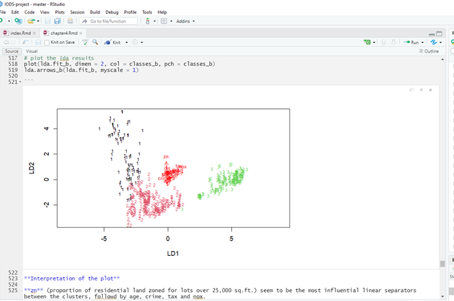

```{r}
date()
```


# Assignment 4: Tasks and Instructions

## 2. Analysis **(max 15 points)**

First we install/use R packages we need to complete the assignment.

```{r}
#install.packages('ggplot2')
library(ggplot2)
library(vtable)
library(MASS)
library(tidyr)
library(dplyr)
library(corrplot)
library(GGally)
library(plotly)
```


### 1. Create a new R Markdown 

Create a new R Markdown file chapter4.Rmd and include it as a child file in your ‘index.Rmd’ file.


### 2. Boston data **(0-1 points)**

Load **Boston data** from **MASS package**. Explore **structure**, **dimensions** and **describe** the dataset briefly. **(0-1 points)**

```{r}

library(MASS)
data("Boston") #download the Boston data
dim(Boston) #dimensions
str(Boston) #structure

```

**Interpretation of the results**

Boston dataset has 506 rows (participants/data points)and 14 columns (variables)

- **crim:** per capita crime rate by town.
- **zn:** proportion of residential land zoned for lots over 25,000 sq.ft.
- **indus:** proportion of non-retail business acres per town
- **chas:** Charles River dummy variable (= 1 if tract bounds river; 0 otherwise).
- **nox:** nitrogen oxides concentration (parts per 10 million).
- **rm:** average number of rooms per dwelling.
- **age:** proportion of owner-occupied units built prior to 1940.
- **dis:** weighted mean of distances to five Boston employment centres.
- **rad:** index of accessibility to radial highways.
- **tax:** full-value property-tax rate per $10,000.
- **ptratio:** pupil-teacher ratio by town.
- **black:** 1000(Bk−0.63) 
2
  where BkBk is the proportion of blacks by town.
- **lstat:** lower status of the population (percent).
- **medv:** median value of owner-occupied homes in $1000s.

All the variables are numeric, but some might be ordinal scaling rather than interval or absolute scaling. 
More detailed description of the dataset can be found [here](https://stat.ethz.ch/R-manual/R-devel/library/MASS/html/Boston.html)


### 3. Graphical overview and variable summaries.**(0-2 points)**

- Show a graphical overview
- Show summaries of the variables in the data. 
- Describe and interpret the outputs, commenting on the distributions of the variables and the relationships between them.

```{r}

gg = ggpairs(Boston, mapping = aes(), lower = list(combo = wrap("facethist", bins = 20)), upper = list(continuous = wrap("cor",  size=2)), title="Graphical overview of Boston data")
gg1 = gg + theme(axis.text = element_text(size=5), strip.text.x = element_text(size = 5), strip.text.y = element_text(size=5)) #change the size of the text
gg1
```

**Interpretation of the figure**

There is quite many graphs in display, so it is a bit hard to read the results:

- **Diagonally:** is presented the distributions of each variable. 
- **Below diagonal line:** is presented the scatter plots between variables. 
- **Above diagonal line:** is presented the correlations between the variables.

Only few variables, such as **rm** (average number of rooms per dwelling) and **medv** (median value of owner-occupied homes in $1000s) seem to be normally distributed. All the other variables, except **chas** (Charles River dummy variable) are more or less continuous variables. There seem to be several linear relationship between variables, but also many non-linear relationships can be detected. For example, based on the distributions and scatter plots **crim** (per capita crime rate by town), **zn** (proportion of residential land zoned for lots over 25,000 sq.ft.) and **black:** (1000(Bk−0.63)) seem to be more exponential rather than normal distribution. Lot of the correlations between the variables are weak, yet significant. However, if variables are not normally distributed calculating Pearsons correlations is not the most informative way to explore the dataset.

Another way to illustrate the relationships between the variables is to use **corrplot()**-command that is part of **corrplot-package**.

```{r}

cor_matrix <- cor(Boston) 
corrplot(cor_matrix, method="circle")
```

**Interpretation of the plot**

The strength of the correlation is illustrated by adjusting the size and transparency of the correlations:

- red indicates **negative correlation**
- blue indicates **positive correlation**
- size indicates if the correlation is **significant**

As you can see in the picture, most relatinships are either unsignificant or atleast weak. This is due to the non-linear properties of most of the variables in Boston dataset.

```{r}
st(Boston) # the command prints a summary statistics table to Viewer-window
```

**Interpretation of the results**

The summary table displays the summary statistics (n, mean, std, min-max, 25% and 75% percentiles). There are **no missing values** in the data set. The summary statistics can also indicate the distribution/linearity of the variables. 

For example, we know that **crim** has exponential distribution. The data supports this: 

- min-max = 0.006-88.976, 
- yet mean is only 3.614, and 
- the 75% of the data (Pctl. 75) has a value less than 3.677

Whereas, for **rm** is normally distributed: 

- min-max = 3.561-8.78, 
- pctl.25 = 5.886, 
- mean = 6.285, 
- pctl.75 = 6.624

25% and 75% are close to min and max and mean is located somewhere in the middle. One way to get rid of the issue on non-linearity is to standardize our data, so it will become "normally distributed". 


### 4. Standardize Boston dataset **(0-2 points)**

- Standardize the dataset
- Print out summaries of the scaled data. 
- How did the variables change? 

```{r}
boston_scaled_KS <- as.data.frame(scale(Boston))
st(boston_scaled_KS)
```

When we standardize variables, we set the same scale for all variables, which allows you to compare scores between different types of variables. When standardizing we set the mean = 0 and std = 1, as can be seen on the summary statistics. Negative values are smaller than mean and positive higher than the mean. 

- Create a categorical variable of the crime rate in the Boston dataset (from the scaled crime rate). 
- Use the quantiles as the break points in the categorical variable. 
- Drop the old crime rate variable from the dataset. 
- Divide the dataset to train and test sets, so that 80% of the data belongs to the train set.

```{r}
# Create categorical variable
boston_scaled_KS$crim <- as.numeric(boston_scaled_KS$crim) #quantiles are Pctl.25 = -0.411	and Pctl.75 = 0.007

bins <- quantile(boston_scaled_KS$crim) #using quantile (counts min, 25%, 50% (median), 75% and 100%)
bins # save it as a vector, so you can use thos as a cut-offs
#           0%          25%          50%          75%         100% 
# -0.419366929 -0.410563278 -0.390280295  0.007389247  9.924109610 

crime <- cut(boston_scaled_KS$crim, breaks = bins, labels=c("low", "med_low", "med_high", "high"), include.lowest = TRUE) #categorical variable of crime 
summary(crime) #you can see that variable now has 4 even categories (1=0-25%, 2=25%-50%, 3=50%-75%, 4=75%-100%)
```

```{r}
# Drop crim and add crime
boston_scaled_KS <- dplyr::select(boston_scaled_KS, -crim) #discard the old crim variable using -crim in the scaled Boston data
glimpse(boston_scaled_KS) #sanity-check that crim has been deleted
```

```{r}
boston_scaled_KS <- data.frame(boston_scaled_KS, crime) #add the new crime categorical variable
glimpse(boston_scaled_KS) #sanity-check that crime exist in the dataset
```

**NOTE.** 

dollar sign is replaced with & due RMarkdown syntax

<span style="color: red;"> **EDITED CODE:** in the Pre-exercise-code of Exercise 4.5, straight AFTER the line that starts with  boston_scaled <- read.table  and ends with sep=",", header = T), you should **ADD ONE LINE:**</span>

<span style="color: black;">**boston_scaled&crime <- factor(boston_scaled&crime, levels = c("low", "med_low", "med_high", "high"))**</span>

```{r}
# Divide dataset into test (20%) and train (80%)
boston_scaled_KS <- read.table("https://raw.githubusercontent.com/KimmoVehkalahti/Helsinki-Open-Data-Science/master/datasets/boston_scaled.txt", sep=",", header = T)

boston_scaled_KS$crime <- factor(boston_scaled_KS$crime, levels = c("low", "med_low", "med_high", "high"))

ind <- sample(nrow(boston_scaled_KS),  size = nrow(boston_scaled_KS) * 0.8) #creating a indicator that has 80% of the variables
train_4 <- boston_scaled_KS[ind,] #80% of the dataset goes to train dataset
test_4 <- boston_scaled_KS[-ind,] #the remaining 20% (-ind) goes to test dataset
correct_classes_4 <- test_4$crime #save the correct classes from test data
test_4 <- dplyr::select(test_4, -crime) # remove the crime variable from test data
```

```{r}
glimpse(test_4) #sanity-check: no crime, rows = 102, columns 13
```

```{r}
glimpse(train_4) #sanity-check: crime, rows = 404, columns 14
```


### 5. Linear discriminant analysis (LDA) **(0-3 points)**

- Fit the linear discriminant analysis on the **train set**. Use the **categorical crime rate** as the **target variable** and all the other variables (.) in the dataset as predictor variables. 
- Draw the LDA (bi)plot.

**About the method:**
In general, LDA method is often use in statistics to find separate groups or clusters (minimum 2) based on different characteristics of the data. LDA has **continuous independent** variable(s) and a **categorical dependent** variable. Where factor analysis is creating factors based on the similariries in data, LDA creates them based on **differences** and defines (in)dependent variables, wheres in factor analysis (especially in exploratory factor analysis) the groups are often data-driven. Also, LDA is used when the groups have already defined (in comparison to cluster analysis). See more details [Linear discriminant analysis (LDA)](https://en.wikipedia.org/wiki/Linear_discriminant_analysis).

Here, we already have defined the groups: low, mid_low, mid_high, high. And we want to see how these groups behave based on the other variables in the data. 

### R code
```{r}
lda.fit_train <- lda(crime ~ ., data = train_4) # linear discriminant analysis (LDA), "." indicates all other variables
lda.fit_train
```

**Interpretation of the results**

Interpretention of the results are adapted from [Linear Discriminant Analysis in R - finnstats](https://www.r-bloggers.com/2021/05/linear-discriminant-analysis-in-r/) and [Discriminant Analysis Essentials in R](http://www.sthda.com/english/articles/36-classification-methods-essentials/146-discriminant-analysis-essentials-in-r/#linear-discriminant-analysis---lda).

- **Prior probabilities of groups:** All the groups are even size, approx. 25% (based on the quarterlies)
- **Group means:** groups means for each variable based on each category. For example, 
  - In **zn** (proportion of residential land zoned for lots over 25,000 sq.ft.) all the other groups, expect **low crime** are getting **negative values**. Since the data is standardized, the positive values indicate that the values are greater than mean. Meaning that in areas with **low crime rate** the proportions of residential land zones are **bigger** in comparison to areas with higher crime rates.
  - In**medv** (median value of owner-occupied homes in $1000s.), only areas with **"high" crime rate** had negative values. This means that the areas with **high crime rate** have on average less owner-occupied homes (median value in 1000s dollars) than other areas.
- **Coefficients of linear discriminants:** first discriminant function (LD1) has all 4 groups (low, mid_low, mid_high, high), second discriminant (LD2) has 3, and LD3 only 2. The coefficient indicate the linear combination of predictors that are used to form the LDA decision rule. For example
  - <span style="color: black;">LD1: .12*zn + .11*indus - .06*chas - .16*nox -.13*rm + .25*age -.07*dis + 3.67*rad + .07*tax + .15*ptratio - .15*black + .24*lstat + .21*medv</span> 
  - To create the groups (4 clusters) **rad** (index of accessibility to radial highways) seems to have the most impact (**3.67**), followed by **age** (0.26), **lstat** (lower status of the population (percent), 0.24) and **medv** (median value of owner-occupied homes in $1000s, 0.21).
- **Proportion of trace:** Percentage separations achieved by the first discriminant function (LD1 = 4 groups) is 95%, LD2 (3 groups) is 4% and LD3 (2groups) 1%

Using the function **plot()** produces biplots of the linear discriminant, obtained by computing LD1 and LD3 for each of the training observations.

```{r}
lda.arrows_train <- function(x, myscale = 1, arrow_heads = 0.1, color = "red", tex = 0.75, choices = c(1,2)){
  heads <- coef(x)
  arrows(x0 = 0, y0 = 0, 
         x1 = myscale * heads[,choices[1]], 
         y1 = myscale * heads[,choices[2]], col=color, length = arrow_heads)
  text(myscale * heads[,choices], labels = row.names(heads), 
       cex = tex, col=color, pos=3)
}

classes_4 <- as.numeric(train_4$crime) # target classes as numeric 4 classes: low, mid_low, mid_high, high

# plot the lda results
plot(lda.fit_train, dimen = 2, col = classes_4, pch = classes_4)
lda.arrows_train(lda.fit_train, myscale = 1)
```
**Interpretation of the plot**

Similar to the coefficients of linear discriminants values in previous table, **rad** (index of accessibility to radial highways) seem to have most impact of differianting the clusters. Based on the plot, the coefficient, and group mean **rad** values seem to be different between **high crime rate** and other categories. This means that the rad has most impact when differentiating the clusters. Moreover, having access in radial highways seem to be most associated with high criminal rate.  


### 6. Predict LDA model **(0-3 points)**

- Save the **crime categories** from the test set and remove the variable
- Predict the classes with the LDA model on the test data 
- Cross tabulate the results with the crime categories from the **test set** 
- Comment on the results

The first two steps have already been done. The test data set should does not contain "crime" variable.
```{r}
# The first two steps have already been done. The test dataset does not contain "crime" variable.
glimpse(test_4) #sanity check, no crime
```

Implement and predict training model (train_4) for testing data (test_4).
```{r}
lda.pred_test <- predict(lda.fit_train, newdata = test_4) # predict classes with test data
table(correct = correct_classes_4, predicted = lda.pred_test$class) # cross tabulate the results
```

**Interpretation of the results**

Overall, the using test data we manage to predict correct 68 values (67%). 

- The model seem to predict well especially the **high** values (high-high = 30 out of 31)
- **med_high** values were predicted correct (med_high - med_high) 13 (48%). 41% was predicted to be med_low (med_high - med_low)
- **med_low** values were predicted correct (med_low - med_low) 15 (60%) and 32% as high (med_low - med_high).
- **low** values were predicted correcr (low - low) 10 (48%) and 43% as med_low (med_low - low).


### 7. K-means **(0-4 points)**

- Reload the Boston dataset and standardize the dataset. 
- Calculate the distances between the observations. 
- Run k-means algorithm on the dataset. 
- Investigate what is the optimal number of clusters and run the algorithm again. 
- Visualize the clusters  using scatterplot
- Interpret the results

Reload the Boston dataset
```{r}
data("Boston")
boston_scl <- as.data.frame(scale(Boston))
st(boston_scl)

# Create categorical variable
boston_scl$crim <- as.numeric(boston_scl$crim)
bins_scl <- quantile(boston_scl$crim) #using quantile (counts min, 25%, 50% (median), 75% and 100%)
bins_scl # save it as a vector, so you can use thos as a cut-offs
#           0%          25%          50%          75%         100% 
# -0.419366929 -0.410563278 -0.390280295  0.007389247  9.924109610 

crime_scl <- cut(boston_scl$crim, breaks = bins_scl, labels=c("low", "med_low", "med_high", "high"), include.lowest = TRUE)
summary(crime_scl) #you can see that variable now has 4 even categories (low=127, med_low=126, med_high=126, high=127)

# Drop crim and add crime
boston_scl <- dplyr::select(boston_scl, -crim) #discard the old crim variable using -crim in the scaled Boston data
boston_scl <- data.frame(boston_scl, crime_scl) #add the new crime categorical variable
st(boston_scl) #sanity-check

boston_scl$crime_scl <- factor(boston_scl$crime_scl, levels = c("low", "med_low", "med_high", "high"))
```

Count distances: Euclidean distance matrix is default, to use manhattan distance matrix, specify method="manhattan"
```{r} 
# Distances between the observations
# ?dist 
dist_eu_scl <- dist(boston_scl)
summary(dist_eu_scl)
dist_man_scl <- dist(boston_scl, method="manhattan")
summary(dist_man_scl)
```

**NOTE.** I  got an error code  <span style="color: red;"> Warning: NAs introduced by coercion </span>. When crime_scl was **a factor**. When **numeric** no error message occured.

Treat crime_scl as numeric rather than factor.
```{r} 
# Distances between the observations
boston_scl$crime_scl <- as.numeric(boston_scl$crime_scl)

dist_eu_scl <- dist(boston_scl)
summary(dist_eu_scl)
dist_man_scl <- dist(boston_scl, method="manhattan")
summary(dist_man_scl)
```

**Interpretation of the results**

The top one is the **euclidean distance** and below **manhattan distance**.  
The distance is used to measure the dissimilarity between vectors. **dist()** command calculates the distance between several vectors (distance between the rows) in a matrix (boston_scl). Larger values indicate that there are greater difference between the rows and therefore, there might be some distinct patterns between different groups. 

In general, I have never counted distances, so I am not very familiar with this approach. I found this [page](https://cmci.colorado.edu/classes/INFO-1301/files/borgatti.htm) quite useful to explain it. If I understood correct, the distance is also arbitrary number, meaning it does not have specific scale to use (like in correlation: -1 to 1). If the distance is zero the points are identical (similar), whereas high values indicate little similarity.

I also found this [page](https://medium.com/analytics-vidhya/role-of-distance-metrics-in-machine-learning-e43391a6bf2e) helpful to explain the basics. 

- In I understoof correctly, **euclidean distance** is calculated used **linear line**, whereas **manhattan** uses **grid-like path** similar to chessboard and hence gets overall higher numbers. 
- Based on the summaries, it seems that we have values that are very similar to each other (min = 0.13 and min_manhattan = 0.26), and values that are very different (max = 12.89 and max_manhattan = 46.55).
- 1st Qu, Median and Mean are relatively similar values (and sort of 3rd Qu.) that might suggest that most values are relatively close together. 
- But since max is so much higher (almost double), we might have either outliers or actual groups with larger distances. 

K-means algorithm
**NOTE.** I used the standardized (boston_scl) dataset, not the raw dataset, like in the exercise.
```{r}
# Investigate what is the optimal number of clusters and run the algorithm again
set.seed(123) #This sets the "spot" where the kmeas()-function will start to generate the k-mean clusters. Setting seed assures that we get the same results each time. Otherwise, it would generate a new k-means each time (different starting point).

k_max_scl <- 10 #define max amount of clusters
twcss_scl <- sapply(1:k_max_scl, function(k){kmeans(boston_scl, k)$tot.withinss}) # calculate the total within sum of square
qplot(x = 1:k_max_scl, y = twcss_scl, geom = 'line', xlim = c(1,10)) # visualize the results
```

**Interpretation of the plot**
The optimal number of clusters is when the value of total WCSS changes radically. Based on the plot, the most optimal number of clusters would be 2-4 clusters. 

Next, we are going to generate and plot these models and then choose, which was is the most optimal. 

Choosing the best model & number of clusters
```{r}
km_2 <- kmeans(boston_scl, centers = 2) # 2 indicates the number of clusters we are generating
km_3 <- kmeans(boston_scl, centers = 3)
km_4 <- kmeans(boston_scl, centers = 4)
# plot the Boston dataset with clusters. Only view the column between 5-10 (nox, rm, age, dis, rad, tax)
pairs(boston_scl, col = km_2$cluster) #2 clusters: red and black
pairs(boston_scl, col = km_3$cluster) #3 clusters: red, black and green
pairs(boston_scl, col = km_4$cluster) #4 clusters: red, black, green and blue  
```

**Interpretation of the plots**

We try to find the most optimal number of clusters (minimal overlapping) and detect some variables that seem to have the most distinct clusters. 

- **Two clusters (km_2):** There is minimal of overlapping between the 2 clusters. Most distinct differences can be detected for **rad**, **black**, **lstat**, and **medv**
- **Three clusters (km_3):** You can still group different colours into their own distinc clusters, not so much overlapping. **indus**, **nox**, **rm**, **age**, **rad** and **tax** seem to have most distinct groups. 
- **Four clusters (km_4):** when having 4 clusters, it seems that the last cluster (black) is overlapping with other clusters. 

Next, we can have a look at the same plots, but focuding only **rm, age, dis, rad and ptratio** variables
```{r}
pairs(boston_scl[5:10], col = km_2$cluster) #2 clusters: red and black
pairs(boston_scl[5:10], col = km_3$cluster) #3 clusters: red, black and green
pairs(boston_scl[5:10], col = km_4$cluster) #4 clusters: red, black, green and blue  

```

**Interpretation of the plot**

- **Two clusters (km_2):** tax and ptratio seem to have less distinct patterns with other variables.
- **Three clusters (km_3):**  tax and ptratio seem to have less distinct patterns with rad
- **Four clusters (km_4):** the 4th clusters (black) is overlapping with other clusters.

Therefore, maybe model with 2-3 clusters are the most optimal to describe the data.


### **Bonus:** to compensate any loss of points from the above exercises **(0-2 points)**

- Perform k-means on the original Boston data with some reasonable number of clusters (> 2). 
- Remember to standardize the dataset 
- Then perform LDA using the clusters as target classes. 
- Include all the variables in the Boston data in the LDA model. 
- Visualize the results with a biplot including the arrows representing the relationships between original variables and LDA. 
- Interpret the results. 
- Which variables are the most influential linear separators for the clusters? 

Read and standardize
```{r}
data("Boston")
boston_bonus <- as.data.frame(scale(Boston))
st(boston_bonus) #sanity check

# Create categorical variable
boston_bonus$crim <- as.numeric(boston_bonus$crim)
bins_b <- quantile(boston_bonus$crim) #using quantile (counts min, 25%, 50% (median), 75% and 100%)
bins_b # save it as a vector, so you can use those as a cut-offs
#           0%          25%          50%          75%         100% 
# -0.419366929 -0.410563278 -0.390280295  0.007389247  9.924109610 
st(boston_bonus)
```
# 
```{r}
crime_b <- cut(boston_bonus$crim, breaks = bins_b, labels=c("low", "med_low", "med_high", "high"), include.lowest = TRUE)
summary(crime_b) #you can see that variable now has 4 even categories (low=127, med_low=126, med_high=126, high=127)

boston_bonus <- dplyr::select(boston_bonus, -crim) #discard the old crim variable using -crim in the scaled Boston data
boston_bonus <- data.frame(boston_bonus, crime_b) #add the new crime categorical variable
boston_bonus$crime_b <- factor(boston_bonus$crime_b, levels = c("low", "med_low", "med_high", "high"))
st(boston_bonus)
```
K-means
```{r}
#k-means
boston_bonus$crime_b <- as.numeric(boston_bonus$crime_b)
set.seed(123) 
k_max <- 10
twcss_b <- sapply(1:k_max, function(k){kmeans(boston_bonus, k)$tot.withinss})
qplot(x = 1:k_max, y = twcss_b, geom = 'line', xlim = c(1,10))
#based on the plot 2-3 clusters are the most optimal
```

**Interpretation of the plot**

Model with 2-3 clusters seem to desrcibe our data the best.

```{r}
bkm_2 <- kmeans(boston_bonus, centers = 2)
pairs(boston_bonus, col = bkm_2$cluster) 
bkm_3 <- kmeans(boston_bonus, centers = 3)
pairs(boston_bonus, col = bkm_3$cluster)
#based on the plots model with 2 clusters seem to be more optimal. The third cluster seems to get very similar results than the other clusters. 
```

**Interpretation of the plot**

- **Two clusters (bkm_2):**  Not so much overlapping, 2 cluster model seem to present our data pretty well.
- **Three clusters (bkm_3):**  Some values have quite a lot of overlapping so you dont even see all 2 colours (e.g., zn, chass, )

Therefore, maybe model with 2 clusters is the most optimal to describe our data. But, since we need to have more than 2 clusters based on the guidelines: *Bonus: Perform k-means on the original Boston data with some reasonable number of clusters* **(> 2)**. We run the following model with 3 clusters.  

**Run LDA**

For some reason when I tried to knit the Assignment 4, this did not work anymore, but instead gave me an error code: <span style="color: red;"> Error in x - group.means[g, ] : non-conformable arrays </span>. Unsure, how to fix it. Below is a screenshot of the model, when it did work. 

Here is the code in <span style="color: blue;">**blue**

**NOTE.** The dollar sign has replaces with &, due to RMarkdown syntax

<span style="color: blue;">boston_bonus <- data.frame(boston_bonus, crime_b) #add the new crime categorical variable </span>
<span style="color: blue;">boston_bonus&crime_b <- factor(boston_bonus&crime_b, levels = c("low", "med_low", "med_high", "high"))</span>

<span style="color: blue;">library(MASS) </span>

<span style="color: blue;">boston_bonus&crime_b <- as.numeric(boston_bonus&crime_b)</span>

<span style="color: blue;">lda.fit_b <- lda(bkm_3&cluster ~ ., data = boston_bonus) **#LDA using the clusters as target classes**</span>

<span style="color: blue;">lda.fit_b </span>


**Interpretation of the results**

- **Prior probabilities of groups:** group1 = 48%, group2=19%, group3=33%
- **Group means:** groups means for each variable based on each category. For example, 
  - **zn** (proportion of residential land zoned for lots over 25,000 sq.ft.) all the other groups, expect **group2** are  **negative**. The positive values indicate that the values are greater than mean. Meaning that in this group the proportions of residential land zones are **bigger** in comparison to groups.
  - **indus** (proportion of non-retail business acres per town), **nox** (nitrogen oxides concentration, parts per 10 million), and **age**, **lstat** (lower status of the population, percent) all had group1 close to 0, group2 = -1 and group3 = 1. This means that these variables might have very distinct patterns based on our clusters and they should be easy to detect. The plot above support this statement. 
  - **dis** (weighted mean of distances to five Boston employment centres) has the opposite values for group2 (-1) and group3 (1)
  - **crime_b** I am unsure how to interpret the crime_b variable though
- **Coefficients of linear discriminants:** first discriminant function (LD1) has 3 clusters and second discriminant (LD2) has 2. The coefficient indicate the linear combination of predictors that are used to form the LDA decision rule. For example
  - **Proportion of trace:** Percentage separations achieved by the first discriminant function (LD1 = 3 clusters) is 84% and LD2 (2 groups) 16%. 


<span style="color: blue;"> lda.arrows_b <- function(x, myscale = 1, arrow_heads = 0.1, color = "red", tex = 0.75, choices = <span style="color: blue;">c(1,2)){</span>

<span style="color: blue;">  heads <- coef(x)</span>
<span style="color: blue;">  arrows(x0 = 0, y0 = 0, </span>

<span style="color: blue;">         x1 = myscale * heads[,choices[1]], </span>

<span style="color: blue;">         y1 = myscale * heads[,choices[2]], col=color, length = arrow_heads)</span>

<span style="color: blue;">  text(myscale * heads[,choices], labels = row.names(heads), </span>
<span style="color: blue;">       cex = tex, col=color, pos=3)</span>

<span style="color: blue;">}</span>

<span style="color: blue;">classes_b <- as.numeric(bkm_3$cluster) # target classes as numeric</span>

<span style="color: blue;"> # plot the lda results</span>
<span style="color: blue;">plot(lda.fit_b, dimen = 2, col = classes_b, pch = classes_b)</span>

<span style="color: blue;">lda.arrows_b(lda.fit_b, myscale = 1)</span>





**Interpretation of the plot**

**zn** (proportion of residential land zoned for lots over 25,000 sq.ft.) seem to be the most influential linear separators between the clusters, followd by age, crime, tax and nox.


### **Super-Bonus:** Plotly() 3D plot **(0-3 points)** (to compensate any loss of points from the above exercises)

- Run the code below for the (scaled) train data that you used to fit the LDA. The code creates a matrix product, which is a projection of the data points.
- Install and access the **plotly** package. Create a 3D plot (cool!) of the columns of the matrix product using the code below.
- **Adjust the code**: add argument **color** as a argument in the plot_ly() function. Set the color to be the **crime classes** of the **train** set. 
- Draw another 3D plot where the **color** is defined by the **clusters of the k-means**. 
- How do the plots differ? Are there any similarities?

```{r}
model_predictors_sb <- dplyr::select(train_4, -crime) #the LD values for the first 3D plot is generated by train_4 data (80%).
# check the dimensions
dim(model_predictors_sb)
dim(lda.fit_train$scaling)
# matrix multiplication
matrix_product_sb <- as.matrix(model_predictors_sb) %*% lda.fit_train$scaling
matrix_product_sb <- as.data.frame(matrix_product_sb)
```

Install and access **plotly** and draw 3D plot
```{r}
#install.packages("plotly")
#plot_ly(x = matrix_product$LD1, y = matrix_product$LD2, z = matrix_product$LD3, type= 'scatter3d', mode='markers')
plot_ly(x = matrix_product_sb$LD1, y = matrix_product_sb$LD2, z = matrix_product_sb$LD3, type= 'scatter3d', mode='markers', color = train_4$crime)
```


- Draw another 3D plot where the **color** is defined by the **clusters of the k-means**. 
- How do the plots differ? Are there any similarities?

3D plot based on k-means
The second plot needs to be separated by k-means. However, train_4 data (80%) was not used to calculate k-means. Instead, based on the assignments, we needed to use the complete Boston dataset. The standardized datasets are:

- Assignment number 7. K-means, creating k-means and graphs, data = boston_scl, variables = km_2, km_3, km_4
- Assignment BONUS. data = boston_bonus, variables = bkm_2. bkm_3

```{r}
data("Boston")
boston_sb <- as.data.frame(scale(Boston))
boston_sb$crim <- as.numeric(boston_sb$crim) # Create categorical variable
bins_sb <- quantile(boston_sb$crim)
crime_sb <- cut(boston_sb$crim, breaks = bins_sb, labels=c("low", "med_low", "med_high", "high"), include.lowest = TRUE)

boston_sb <- dplyr::select(boston_sb, -crim) 
boston_sb <- data.frame(boston_sb, crime_sb) 
boston_sb$crime_sb <- as.numeric(boston_sb$crime_sb)
sbkm_3 <- kmeans(boston_sb, centers = 3)
boston_sb$crim <- as.numeric(boston_sb$crim)
lda.fit_sb <- lda(sbkm_3$cluster ~ ., data = boston_sb) #LDA using the clusters as target classes
lda.fit_sb
```

```{r}
model_predictors_sb <- dplyr::select(boston_sb, -crime_sb)
dim(model_predictors_sb)
dim(lda.fit_sb$scaling)

boston_sb$crime_sb <- factor(boston_sb$crime_sb, levels = c("low", "med_low", "med_high", "high"))
boston_sb$crime_sb <- as.numeric(boston_sb$crime_sb)
# matrix_product_sb <- as.matrix(model_predictors_sb) %*% lda.fit_sb$scaling

```

The last lines **matrix_product_sb <- as.matrix(...)** gives an **ERROR CODE** 

**NOTE.** The dollar sign has replaces with & and a star with extra %

<span style="color: red;"> Error in as.matrix(model_predictors_sb) %%% lda.fit_sb&scaling : non-conformable arguments </span>

Install and access **plotly** and draw 3D plot
```{r}
#plot_ly(x = matrix_product$LD1, y = matrix_product$LD2, z = matrix_product$LD3, type= 'scatter3d', mode='markers')
plot_ly(x = matrix_product_sb$LD1, y = matrix_product_sb$LD2, z = matrix_product_sb$LD3, type= 'scatter3d', mode='markers', color = boston_sb$clusters)
```


**Interpret results**

Unsure, why it is not working. Any suggestions?


## 2. Data wrangling  **(max 5 points)**
This code is for the next week’s data! 

See [create_human.R](https://github.com/kiirasar/IODS-project/tree/master/data) and **human.csv**


End of assignment 4